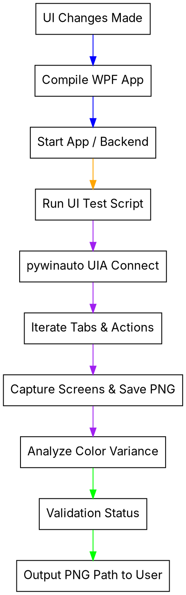

# WPF GUI Verification

## Overview
As a blind AI agent, you cannot visually inspect the WPF GUI or manually click buttons. This skill provides a concrete methodology to programmatically verify frontend views, run automated GUI smoke tests using `pywinauto` and Win32 APIs, capture screenshots, and perform color-variance and UI-accessibility audits.

## When to Use
Use this skill whenever:
- A new WPF View or ViewModel change is implemented and needs end-to-end rendering validation.
- Verifying the release build of the application before marking a task as release-ready.
- Checking for layout crashes, tab switches, or hidden UI deadlocks during runtime.
- Creating visual artifacts (screenshots) for the human user to review.

### When NOT to Use
- Backend-only modifications where the WPF UI is unaffected.
- Headless unit tests or CLI-only scripts.



## Core Patterns

### 1. Automated GUI Smoke Tests (pywinauto + UIA)
Since you cannot interact manually, use Pywinauto connected to the Windows Accessibility / UI Automation (UIA) backend to select tabs, press buttons, and locate visual tree nodes.

```python
#  GOOD: Automation script pattern to connect, switch tabs, and verify active UI rects
from pywinauto import Application
import time

# Connect to the running WPF application by title
app = Application(backend="uia").connect(title_re=".*PB Studio.*", timeout=10)
win = app.window(title_re=".*PB Studio.*")
win.wait("visible", timeout=5)

# Select a tab item programmatically
tab = win.child_window(title="DIRECTOR", control_type="TabItem")
tab.select()
time.sleep(1.0) # Wait for animations and data bindings to fire
```

---

### 2. Capturing and Saving Screenshots programmatically
Generate PNG screenshots of the running WPF window boundaries, saving them under `gui_screenshots/` so the human partner or multi-modal models can inspect the visual design.

```python
#  GOOD: Grab correct DPI-aware window screenshot using Win32 API rects and Pillow
import ctypes
from PIL import ImageGrab

# Enforce DPI awareness to avoid truncated or offset screenshots
ctypes.windll.shcore.SetProcessDpiAwareness(2)

rect = win.rectangle()
# Capture the bounding box of the active WPF window
img = ImageGrab.grab(bbox=(rect.left, rect.top, rect.right, rect.bottom))
img.save("gui_screenshots/tab_director.png")
```

---

### 3. Programmatic Visual Verification (Color-Variance Check)
Since you cannot see the image, write algorithms to verify that the screenshot contains non-trivial, dynamic UI content (meaning it is not a solid black screen or blank white canvas). Compute the variance between color channels in the rendered zone.

```python
#  GOOD: Variance evaluation of image content
def has_rendering_content(img):
    w, h = img.size
    if w < 100 or h < 100:
        return False, "Window size too small"
    
    # Sample pixels across a grid inside the content zone
    pixels = [img.getpixel((x, y))[:3] for x in range(50, w-50, 10) for y in range(50, h-50, 10)]
    r_vals, g_vals, b_vals = zip(*pixels)
    
    # Calculate difference between min/max colors
    variance = (max(r_vals) - min(r_vals)) + (max(g_vals) - min(g_vals)) + (max(b_vals) - min(b_vals))
    
    # A variance > 30 proves that different colors and elements are rendering (not blank)
    return variance > 30, f"variance={variance}"
```

## Quick Reference (WPF Verification Scripts)

| Automation Script | Target | Method |
| :--- | :--- | :--- |
| `python Tests/gui_screenshot_v3.py` | Full View Rendering | Switch tabs, capture screenshots, and assert color-variance is passing. |
| `powershell .\verify_release_smoke.ps1` | Release Boot Stability | Build WPF in Release, start backend, launch EXE, assert no crash on launch. |
| `powershell .\SSE-RECOVERY-TEST.bat` | SSE Client Connectivity | Stop/start backend, take screenshots, assert overlay is visible and successfully recovered. |

## Red Flags - STOP and Start Over
- 🚩 **"I am sure the view looks correct since C# compilation passed."** (No! Missing XAML resources, bad data bindings, or design-time crashes can still cause blank pages or app hangs at runtime. Run `gui_screenshot_v3.py`!).
- 🚩 **"I can't see the UI, so testing it is impossible."** (False. UIA allows you to fully inspect buttons, read text values, invoke clicks, and assert the window bounds).
- 🚩 **"Claiming visual alignment without generating screenshots."** (Never claim a visual layout looks "perfect" to the user without generating screenshots in `gui_screenshots/` or `logs/` and explicitly linking the absolute file path).

## Iron Law of Visual Honesty
> [!IMPORTANT]
> **Always report the exact file paths of captured screenshots in your response.**
> Present clickable absolute markdown links (e.g., ``) so the user can immediately visually review the outcome.
