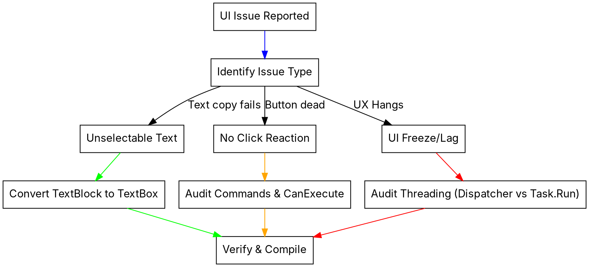

# WPF Visual Blind Spot

## Overview
As an AI coding assistant, you have no visual perception (eyes) and cannot interact with the WPF GUI. Visual-only runtime errors (UX freezes, missing hover/click states, uncopyable text) are invisible to you. This skill defines a systematic, static code-audit and log-driven methodology to diagnose and fix WPF UI/UX defects.

## When to Use
Use this skill whenever:
- User reports that a button or control does not react to clicks or hover.
- User reports UI freezes or lag (UX hangs).
- User complains about unselectable or uncopyable error messages or text in the UI.
- WPF binding errors or dispatcher crashes are suspected.

### When NOT to Use
- Backend-only bugs (API routers, SQLite database, audio/video pipelines) that do not interact with the WPF frontend.
- Command-line tools or scripts without a graphical WPF interface.



## Core Pattern

### 1. Unselectable Text (TextBlock vs. TextBox)
`TextBlock` is read-only and static; users cannot highlight or copy its content. Crucial diagnostics (e.g., file paths, exceptions, error logs) must always be copyable.

#### Before (Non-copyable TextBlock)
```xml
<!-- ❌ BAD: User cannot select or copy the error message -->
<TextBlock Text="{Binding ErrorMessage}" Foreground="Red" TextWrapping="Wrap" />
```

#### After (Copyable TextBox with TextBlock appearance)
```xml
<!--  GOOD: Style TextBox to look exactly like a TextBlock while being selectable -->
<TextBox Text="{Binding ErrorMessage}" 
         IsReadOnly="True" 
         Background="Transparent" 
         BorderThickness="0" 
         TextWrapping="Wrap" 
         Foreground="Red" 
         Focusable="True" />
```

---

### 2. Missing Click Reactions (Command & Binding Audits)
If a button is inactive or does not trigger its command:
1. **CanExecute Lock:** Check if the VM uses `[RelayCommand(CanExecute = nameof(CanDoAction))]`. If `CanDoAction` returns `false`, the button is disabled.
2. **Naming Discrepancy:** `CommunityToolkit.Mvvm` appends `Command` to generated commands. A method `ExecuteActionAsync` becomes `ExecuteActionCommand`.
3. **Overlay Interception:** Ensure no transparent elements (e.g., busy overlay grids) with `IsHitTestVisible="True"` block the mouse clicks.

#### Before (Silent Binding Failure & Deactivated Command)
```xml
<!-- XAML (Binding to the wrong generated command name) -->
<Button Content="Process" Command="{Binding ProcessData}" />
```
```csharp
// ViewModel (Property state makes CanProcess return false forever)
[RelayCommand(CanExecute = nameof(CanProcess))]
private async Task ProcessDataAsync() { ... }
private bool CanProcess() => _hasData && _isInitialized; // ❌ Bug: _isInitialized never set to true
```

#### After (Correct Naming & Active State Guard)
```xml
<!--  GOOD: Bound to 'ProcessDataCommand' generated by Source Generators -->
<Button Content="Process" Command="{Binding ProcessDataCommand}" />
```
```csharp
// ViewModel (State transition resets and fires update notifications)
[RelayCommand(CanExecute = nameof(CanProcess))]
private async Task ProcessDataAsync() { ... }
private bool CanProcess() => _hasData; // Corrected state evaluation
```

---

### 3. UI Freezes (Dispatcher Thread Blockage)
Any CPU-heavy operations (e.g., Base64 decoding, large JSON parsing, image initialization) or synchronous E/A calls on the UI thread will freeze the application.

#### Before (Synchronous Base64 decode on Dispatcher)
```csharp
// ❌ BAD: Heavy CPU task blocks the UI Thread inside Dispatcher.InvokeAsync
await Application.Current.Dispatcher.InvokeAsync(() => {
    var rawBytes = Convert.FromBase64String(rawBase64); // Blocks
    var bmp = new BitmapImage();
    bmp.BeginInit();
    bmp.StreamSource = new MemoryStream(rawBytes);
    bmp.EndInit(); // Heavy decoding blocks
    Thumbnails.Add(bmp);
});
```

#### After (Thread-safe Async decoding off UI Thread)
```csharp
//  GOOD: Decode on Background Thread, Freeze image, and Add on UI Thread
var bmp = await Task.Run(() => {
    var rawBytes = Convert.FromBase64String(rawBase64);
    var image = new BitmapImage();
    image.BeginInit();
    image.StreamSource = new MemoryStream(rawBytes);
    image.CacheOption = BitmapCacheOption.OnLoad;
    image.EndInit();
    image.Freeze(); // Makes the image thread-safe for cross-thread access
    return image;
});

await Application.Current.Dispatcher.InvokeAsync(() => {
    Thumbnails.Add(bmp); // Super fast, zero lag
});
```

## Quick Reference

| Symptom | Diagnostic Search Pattern | Resolution |
| :--- | :--- | :--- |
| **Unselectable Text** | `grep -rn "<TextBlock Text="` in `.xaml` | Convert to `<TextBox IsReadOnly="True" BorderThickness="0" Background="Transparent" />` |
| **Dead Button** | `grep -rn "Command="` in `.xaml` | Check matching ViewModel property for `[RelayCommand]` and `CanExecute` constraints. |
| **UI Lag / Freeze** | Search for `Dispatcher.Invoke` with complex work, `.Result`, or `.Wait()` in ViewModels | Run heavy parsing on `Task.Run()`, `.Freeze()` UI elements, use fully asynchronous pipelines. |
| **Missing Updates** | Check if ViewModel fields lack `[ObservableProperty]` or `OnPropertyChanged()` triggers | Add annotations or trigger manual notification updates. |

## Implementation Guidelines

### Phase 1: Static Code Scans
Since you cannot see the UI, you must actively parse XAML and ViewModel structures:
1. Match XAML Bindings against VM source code.
2. Check if event handlers or async commands lack proper error-catching try/catch blocks (which cause silent crashes or unobserved exceptions).
3. Search for hit-test blockages in Views (`IsHitTestVisible="False"` or missing panel bounds).

### Phase 2: Log Interpretation
WPF redirects UI binding failures to standard output. Examine:
- **Binding Failures:** Look for `System.Windows.Data Error` in debug output or app logs.
- **Task Exceptions:** Search logs (`logs/wpf_app.log`) for `Unbeobachtete Task-Exception` (Unobserved Task Exception) indicating thread-level silent failures.

```text
// Example from C# Log (logs/wpf_app.log):
[Error] PBStudio.UI.App: Unbeobachtete Task-Exception
System.AggregateException: A Task's exception(s) were not observed...
 ---> System.ObjectDisposedException: Cannot access a disposed object.
    at System.Threading.SemaphoreSlim.Release(Int32 releaseCount)
    at PBStudio.UI.ViewModels.VideoLibraryViewModel.LoadClipsAsync() ...
```

## Red Flags - STOP and Start Over
- 🚩 **"The button doesn't respond, it must be a styling issue."** (No, usually it is a binding name mismatch or `CanExecute` returning false).
- 🚩 **"Using Dispatcher.Invoke for the whole workflow is safer."** (No, Dispatcher.Invoke must ONLY be used for UI-property assignments, not computing or decoding).
- 🚩 **"TextBlock is fine because users rarely need to copy this error."** (No! EVERY user-facing error message, path, log item, and chat response MUST be selectable and copyable).

## Iron Law of UI Integration
> [!IMPORTANT]
> **Violating the letter of these WPF patterns is violating the spirit of UI accessibility and system health.**
> Never assume a UI works just because it compiles. Perform structural ViewModel testing and verify thread-safety via code analysis.

## Common Rationalizations vs. Reality

| Rationalization | Reality |
| :--- | :--- |
| "A simple TextBlock looks cleaner." | TextBoxes with transparent background and zero border look exactly like TextBlocks but let users copy vital error logs. |
| "Using `.Result` simplifies the async-await cascade." | Calling `.Result` or `.Wait()` in ViewModels guarantees WPF UI deadlocks. |
| "The binding error is just a warning, it's fine." | Silent WPF binding errors burn CPU and cause unresponsive UI. |
