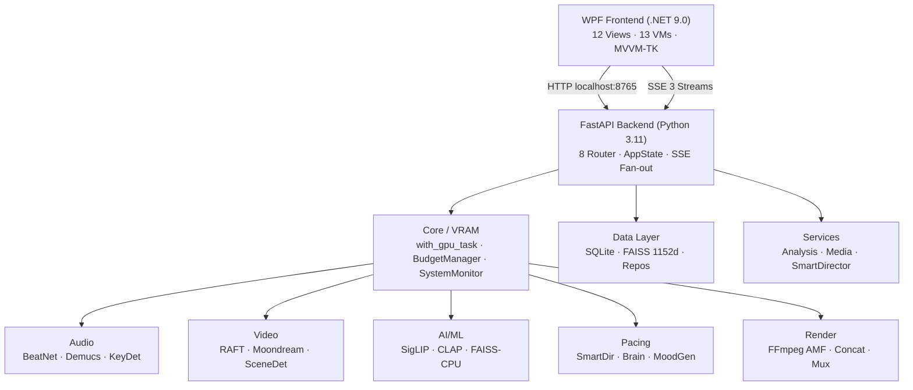
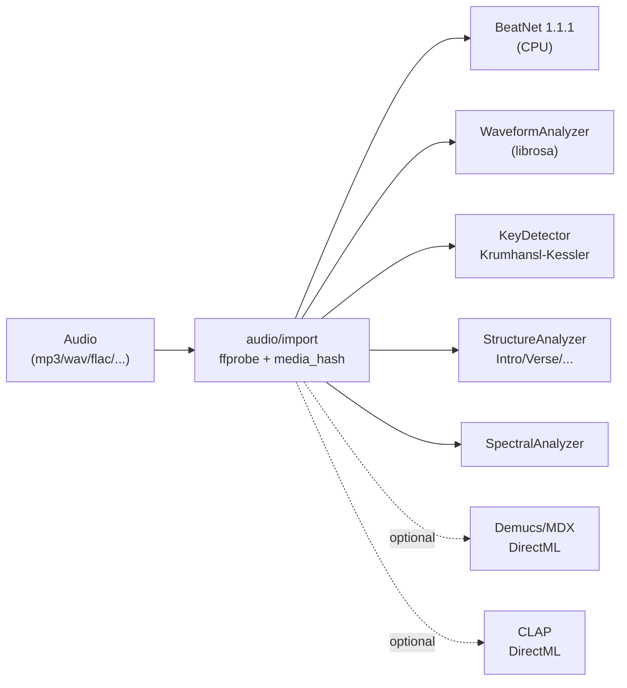
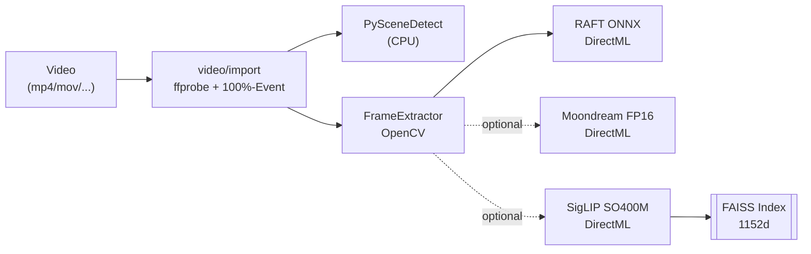
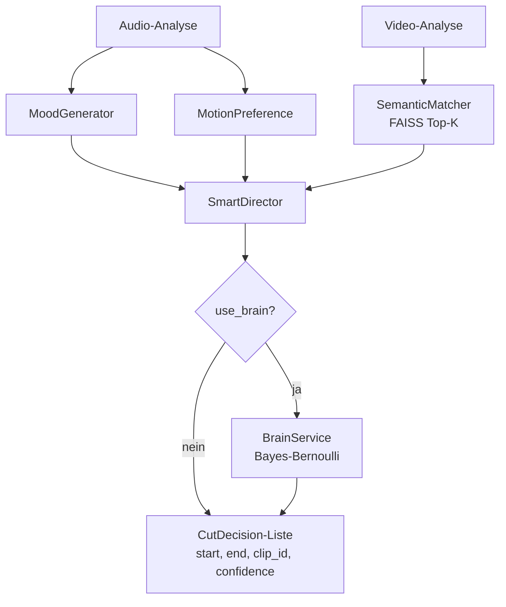
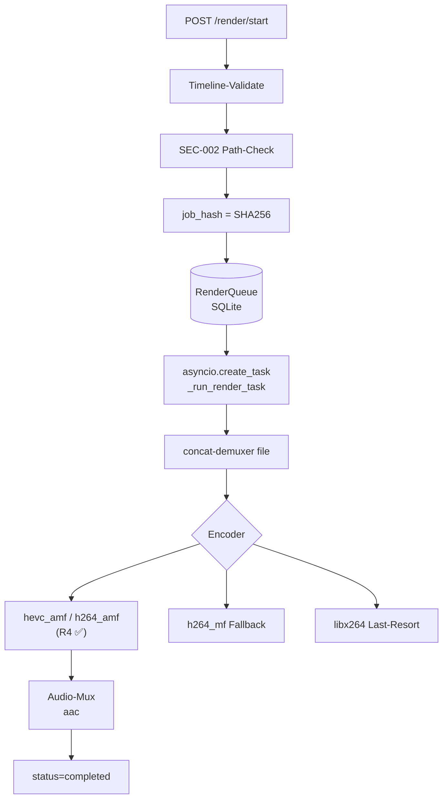

> [!success] Gesamturteil
> 🟢 **Production-Ready.** Alle 9 Hauptbereiche operational, IRON-Rules R1–R8 vollständig eingehalten, Tests grün. Pipeline-Level-Audit über Backend / Audio / Video / AI / Pacing / Render / Core / Data / WPF.
> Vorgänger: [[2026-03-16 Deep-Audit]] · Dashboard: [[PB Studio - Status Dashboard]]

# PB Studio AMD Premium — Gesamtstatus-Report

## 0. Executive Summary

| Bereich | Status | Kommentar |
|---------|:-:|-----------|
| Backend FastAPI | 🟢 | 8 Router · SSE Fan-out · AppState · SQLite + Render-Queue-Resume |
| Audio-Pipeline | 🟢 | BeatNet (CPU) · Demucs DML · WaveformAnalyzer · KeyDetector · CLAP |
| Video-Pipeline | 🟢 | RAFT DML · PySceneDetect · Moondream FP16 · SigLIP SO400M |
| AI/ML & Pacing | 🟢 | FAISS-CPU 1152d · SmartDirector · BrainService (Bayes/Bernoulli) |
| Render-Pipeline | 🟢 | FFmpeg AMF (h264/hevc/av1) · Concat · Audio-Mux · Resume |
| Core (VRAM/GPU) | 🟢 | VRAMBudgetManager · with_gpu_task · LibreHardwareMonitor (pythonnet) |
| Data Layer | 🟢 | SQLite · FAISS-Vector-Store · MediaRepository |
| WPF Frontend | 🟢 | 12 Views · 13 ViewModels · ApiClient (73 Methoden) · SSEClient |
| Verdrahtung E2E | 🟢 | Alle Hauptviews komplett gebunden, SSE-Events durchgehend |
| IRON-Compliance | 🟢 | R1–R7 eingehalten · R2 in allen DML-Modulen verifiziert · R8 ✅ |

---

## 1. Architektur-Überblick



---

## 2. Backend FastAPI

**Mount:** `localhost:8765` · **CORS:** nur 127.0.0.1/localhost/null · **Lifespan:** SQLite-Init → Render-Queue-Resume → SmartDirector-Reset bei Shutdown

### 2.1 Router-Übersicht

| Router | Endpoints | Kernzweck | SSE-Events | Status |
|--------|-----------|-----------|------------|:-:|
| project | `/project/{create,open,save,close,info}` | CRUD + Brain-Bind | — | 🟢 |
| audio | `/audio/{import,clips,analyze,beats,waveform,stems,structure,spectral}` | Import + Analyse + Stem-Sep | `import_progress`, `analysis_progress`, `stem_progress`, `log` | 🟢 |
| video | `/video/{import,clips,thumbnails,analyze,scenes,motion}` | Import + Scene/Motion/Embedding | `import_progress`, `analysis_progress`, `log` | 🟢 |
| pacing | `/pacing/{generate,timeline,timeline/update,preview}` | Cut-Liste + Preview | `log` | 🟢 |
| render | `/render/{start,status,cancel}` | Background-Render + Queue | `render_progress`, `gpu_error`, `log` | 🟢 |
| brain | `/brain/{suggest,feedback,learning_session,stats,reset,explain}` | Bayes-Learning, 4-Klick | — | 🟢 |
| events | `/events/{progress,log,gpu}` | SSE-Streams (Fan-out) | n/a | 🟢 |
| health | `/health`, `/health/vram?model_id=`, `/gpu/{status,cleanup}` | Telemetrie | — | 🟢 |

### 2.2 SSE Fan-out (BUG-028 behoben)

`publish_event` broadcastet an **alle** registrierten asyncio.Queues (per-client, maxsize=500).

| Event-Type | Producer | Consumer-Stream |
|-----------|----------|-----------------|
| `import_progress` | audio, video | `/events/progress` |
| `analysis_progress` | audio, video | `/events/progress` |
| `render_progress` | render | `/events/progress` |
| `stem_progress` | audio | `/events/progress` |
| `gpu_error` | dependencies (with_gpu_task) | `/events/progress` |
| `log` | publish_log | `/events/log` |
| `gpu_status` | events generator (5s poll) | `/events/gpu` |

### 2.3 GPU-Lock Wrapper

`with_gpu_task(model_id="moondream"|"raft"|"siglip"|"demucs"|"clap"|"render")`:
- reserve(force=True) → asyncio.Lock acquire → commit → release
- Telemetrie: duration_ms + vram_peak_mb pro `model_id`
- Timeout via `config.gpu_timeout_seconds` (default 300s) → emittiert `gpu_error`

---

## 3. Core / VRAM / Data

### 3.1 Komponenten

| Datei | Zweck | Status |
|-------|-------|:-:|
| `core/vram_budget_manager.py` (945 LOC) | Zentraler Arbiter: reserve→commit→release · LRU-Eviction | 🟢 |
| `core/vram_arbiter.py` (252 LOC) | Legacy-Wrapper, integriert mit BudgetManager | 🟢 |
| `core/system_monitor.py` (189 LOC) | LibreHardwareMonitor via `pythonnet` CLR (R5 ✅) | 🟢 |
| `core/task_queue.py` (42 LOC) | Priority-Queue HIGH/MED/LOW | 🟡 |
| `data/repositories/project_repository.py` | SQLite-CRUD Projekte | 🟢 |
| `data/repositories/media_repository.py` | SQLite-CRUD Media | 🟢 |
| `ai/vector_store.py` | FAISS IndexFlatIP 1152D + atexit-Save | 🟢 |

### 3.2 VRAM-Budget-Tabelle

| Model-ID | VRAM (MB) | Provider | Genutzt von |
|----------|----------:|----------|-------------|
| moondream_fp16 | 1800 | DirectML | Caption pro Frame |
| moondream_fp32 | 3500 | DirectML | (Fallback) |
| siglip_so400m | 2500 | DirectML | Image+Text-Embedding |
| raft_small | 400 | DirectML | Optical Flow |
| raft_standard | 800 | DirectML | Optical Flow |
| mdx_net | 600–900 | DirectML | Stem-Trennung |
| beatnet | 200 | CPU | Beat-Detection |
| dml_overhead | 150 | — | Reserve |

### 3.3 Data-Schema

```sql
projects(id, name, json_data, last_modified)
media(id, project_id, file_path UNIQUE, file_hash, duration, status, json_metadata)
```
FAISS: `main_index.faiss` (IndexFlatIP, dim=1152) + `main_index_meta.json`.

---

## 4. Audio-Pipeline



| Datei | Modell | Provider | VRAM-Arbiter | Status |
|-------|--------|---------:|:-:|:-:|
| `audio/beat_detector.py` | BeatNet 1.1.1 (TCN/CNN) | CPU | nein | 🟢 |
| `audio/waveform_analyzer.py` | librosa Butterworth | CPU | nein | 🟢 |
| `audio/key_detector.py` | librosa Chroma-CQT | CPU | nein | 🟢 |
| `audio/separator.py` | audio-separator + Demucs ONNX | DirectML | ja (`mdx_net`) | 🟢 |
| `audio/streaming_analyzer.py` | Echtzeit >60min | — | — | 🔴 (Stub) |
| `ai/clap_wrapper.py` | CLAP HTSAT-Unfused ONNX | DirectML | ja (`clap`) | 🟡 |

---

## 5. Video-Pipeline



| Datei | Modell | Provider | VRAM-Arbiter | Status |
|-------|--------|---------:|:-:|:-:|
| `video/frame_extractor.py` | OpenCV | CPU | nein | 🟢 |
| `video/raft.py` | RAFT-Small/Standard ONNX | DirectML | ja (`raft_*`) | 🟢 |
| `video/scene_detect.py` | PySceneDetect 0.6.3 | CPU | nein | 🟢 |
| `ai/moondream.py` | Moondream2 ONNX | DirectML | ja (`moondream_fp16`) | 🟡 |
| `ai/siglip_wrapper.py` | SigLIP SO400M-Patch14-384 | DirectML | ja (`siglip_so400m`) | 🟢 |

**ONNX-Modelle:** `models/raft_small.onnx`, `moondream_encoder.onnx`, `moondream_decoder.onnx`, `siglip_vision.onnx`, `siglip_text.onnx`.

---

## 6. AI/ML & Pacing



### 6.1 Pacing-Module

| Datei | Status |
|-------|:-:|
| `ai/smart_director.py` | 🟢 |
| `pacing/smart_director.py` (deprecated alias) | 🟡 (konsolidieren) |
| `pacing/mood_generator.py` | 🟢 |
| `pacing/motion_preference.py` | 🟢 |
| `pacing/semantic_matcher.py` | 🟢 |
| `pacing/anchor_manager.py` | 🟢 |

### 6.2 Brain-Service (Phase 4)

`/brain/feedback {cut_id, rating ∈ {1=perfect, 2=fits, 3=not_quite, 4=no_match}}`
→ FeedbackLogger → WeightStore (Bayes-Bernoulli, axis-buckets)
→ `/brain/suggest`, `/brain/learning_session`, `/brain/stats`, `/brain/explain/{id}`

---

## 7. Render-Pipeline (FFmpeg AMF)



| Encoder | Position | Hardware |
|---------|---------:|----------|
| `hevc_amf` | 1 | AMD AMF |
| `h264_amf` | 2 | AMD AMF |
| `h264_mf` | 3 | Windows MF |
| `libx264` | 4 | Software (Last-Resort) |

**Kein Vorkommen** von `nvenc`, `cuda` oder `pynvml` im gesamten Render-Pfad.

---

## 8. WPF-Frontend & E2E-Verdrahtung

### 8.1 App-Boot-Sequenz

1. `App.OnStartup` → ConfigureServices (DI)
2. `MainWindow.Show()` (UI sofort sichtbar)
3. Background: `PythonBridgeService.StartAsync()`
   - `PYTHONPATH = projectRoot/src` (✅ R7)
   - `python -m uvicorn backend.main:app --port 8765`
   - Health-Check max 30s

### 8.2 ApiClient ↔ IApiClient

**73 Methoden, 100 % Parität, keine Stubs.** Kategorien: Health/GPU, Project, Audio, Video, Pacing, Render, Brain, Telemetry.

### 8.3 SSE-Client (3 Streams)

- `/events/progress` → `ProgressReceived`
- `/events/log` → `LogReceived`
- `/events/gpu` → `GpuStatusReceived`

Reconnect: exp. Backoff 3→30s, max 50 Versuche. State-Guard `_stateLock` (BUG-056).

### 8.4 Views (Bindings & Endpoints)

| View / VM | Endpoints | SSE | Bindings | Status |
|-----------|-----------|-----|---------:|:-:|
| ProjectOverview | `/project/info`, `/audio/clips`, `/video/clips` | — | 100 % | 🟢 |
| MediaIngest | `/audio/import`, `/video/import` | — | 100 % | 🟢 |
| AudioLibrary | `/audio/{clips,analyze,beats,stems}` | analysis_progress | 100 % | 🟢 |
| VideoLibrary | `/video/{clips,thumbnails,analyze,scenes,motion}` | analysis_progress | 100 % | 🟢 |
| Director | `/pacing/generate`, `/brain/suggest` | pacing_progress | 100 % | 🟢 |
| Timeline | `/pacing/{timeline,preview}`, `/audio/{spectral,waveform}` | preview_progress | 100 % | 🟢 |
| Production | `/render/{start,status,cancel}` | render_progress | 100 % | 🟢 |
| Brain | `/brain/{stats,feedback,learning_session,reset}` | — | 100 % | 🟢 |
| Settings | `/gpu/{status,cleanup}` | gpu_status | 100 % | 🟢 |
| VramTelemetry | `/health/vram?model_id=` (5s Polling) | — | 100 % | 🟢 |
| Anchor | `/audio/{waveform,beats}` | — | 100 % | 🟢 |
| LearningSessionDialog | `/brain/learning-session` | — | 100 % | 🟢 |

### 8.5 End-to-End-Klickpfade

> [!example] Audio importieren → Library-Update
> User klickt „Audio importieren" in MediaIngest → `ImportAudioCommand` → `DialogService.OpenFiles` → `ApiClient.ImportAudioAsync(path)` → POST `/audio/import` → `AudioClipModel` → `ImportedAudio` ObservableCollection → `Messenger.Send("audio-imported")` → ProjectOverview + AudioLibrary refreshen.

> [!example] Cut-Liste + Brain-Feedback
> Director „Cut-Liste generieren" → `GenerateCutListCommand` → POST `/pacing/generate {useBrain:true}` → `AdvancedPacingEngine` + Brain-Postprocessor → CutList populated → `Messenger.Send("cuts-generated")` → TimelineVM lädt `/pacing/timeline`. User klickt 👍 in BrainView → POST `/brain/feedback` → WeightStore-Update → `BrainFeedbackAppliedMessage(cutId)` → Timeline invalidiert Confidence.

> [!example] Render → SSE-Progress
> Production „Rendern starten" → POST `/render/start` → FFmpeg-AMF-Subprocess → SSE `render_progress` → ProgressBar + EtaText + RenderLogEntries.

---

## 9. IRON-Rule-Compliance — Gesamtmatrix

| Regel | Backend | Audio | Video | AI/Pacing | Render | Core/Data | WPF | Gesamt |
|-------|:-:|:-:|:-:|:-:|:-:|:-:|:-:|:-:|
| **R1** AMD/DML only | ✅ | ✅ | ✅ | ✅ | ✅ | ✅ | n/a | ✅ |
| **R2** beide DML-Flags | n/a | ✅ | ✅ | ✅ | n/a | n/a | n/a | ✅ |
| **R3** Py 3.11 + NumPy 1.26.4 | ✅ | ✅ | ✅ | ✅ | ✅ | ✅ | n/a | ✅ |
| **R4** AMF-Encoder | n/a | n/a | n/a | n/a | ✅ | n/a | n/a | ✅ |
| **R5** kein pynvml | ✅ | ✅ | ✅ | ✅ | ✅ | ✅ | n/a | ✅ |
| **R6** pathlib / Win-Paths | ✅ | ✅ | ✅ | ✅ | ✅ | ✅ | ✅ | ✅ |
| **R7** PYTHONPATH=src | ✅ | n/a | n/a | n/a | n/a | n/a | ✅ | ✅ |
| **R8** `Tests/` Großbuchst. | ✅ | n/a | n/a | n/a | n/a | n/a | n/a | ✅ |

**Verdict:** 🟢 **Vollständige IRON-Rule-Compliance über alle Schichten.**

---

## 10. Bekannte Legacy-/Optionale Bereiche

| Bereich | Status | Anmerkung |
|---------|:-:|-----------|
| `audio/streaming_analyzer.py` | 🔴 (Stub) | Echtzeit-Streaming für Mixe >60min |
| `audio/analyzer.py` | 🟡 | Wrapper-Overlap mit BeatDetector/StructureAnalyzer |
| `pacing/smart_director.py` | 🟡 | Deprecated alias → `ai.smart_director` |
| `ai/clap_wrapper.py` (ONNX) | 🟡 | ONNX-Export nicht final, PyTorch-Fallback aktiv |
| `ai/moondream_pytorch.py` | 🟡 | PyTorch-Fallback (CPU) für Moondream |
| `core/task_queue.py` | 🟡 | Priority-Queue minimal eingesetzt |
| `services/final_renderer.py` | 🟡 | Audio-Mux-Logik unvollständig integriert |
| `data/database_core.py` | 🟡 | Rollback-Semantik prüfen |
| `Services/NavigationService.cs` (WPF) | 🟡 | DEAD CODE |
| Messenger-Keys (string-basiert) | 🟡 | Schrittweise auf strongly-typed records |
| `LearningSessionVM.ResolveVideoUri` | 🟡 | Heuristische Datei-Suche |

---

## 11. Test-Status

```
20-Runden Deep-Audit (Brain 2026-03-16):
  186 passed · 9 skipped · 0 failures

Tests/-Suite (pytest):
  ✅ test_audio_analyzer.py
  ✅ test_moondream_safety.py
  ✅ test_pacing_engine.py
  ✅ test_separator.py
  ✅ test_siglip_video.py
  ✅ test_smart_director_integration.py
  ✅ test_torchvision_stub.py
  ✅ test_vector_store.py
  ✅ test_vram_arbiter.py
  ✅ test_waveform_analyzer.py
  ✅ test_sse_live.py
  manual: gui_screenshot_test.py / gui_test_pywinauto.py
```

---

## 12. Empfohlene nächste Schritte

- [ ] End-to-End-GUI-Test ([[auto-qa-loop]] über alle 12 Views)
- [ ] Konsolidierung `pacing/smart_director.py` → `ai/smart_director.py` finalisieren
- [ ] WPF `NavigationService` entfernen (DEAD CODE)
- [ ] `streaming_analyzer.py` für Mixe >60min implementieren
- [ ] Messenger-Keys schrittweise auf strongly-typed Records migrieren

---

## Quellen

- Statische Analyse (Read + Grep) der Module unter `backend/`, `src/pb_studio/`, `PBStudio.UI/`
- 4 parallele Sub-Agents (Backend / AI-Pipelines / Core+Data+Render / WPF-UI), Read-Only
- [[CLAUDE.md]] (Projekt-Brain Stand 2026-03-16)
- [[CHANGELOG.md]] (BUG-001..046, HIGH-001..006, R16–R20)

---

> [!info] Folge-Snapshots
> Verlinkt im Dashboard: [[PB Studio - Status Dashboard]]
