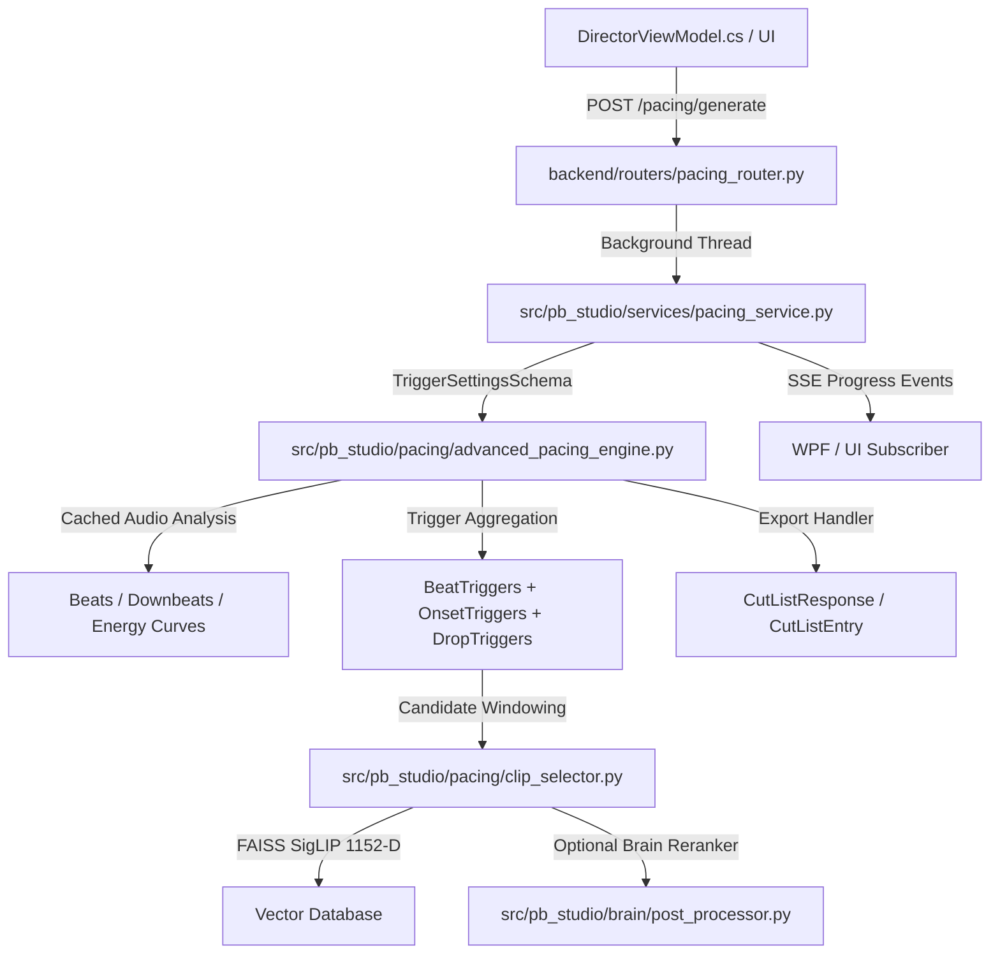

# Audio-Video Pacing Specialist — Elite Coding & Systems Skill (PB Studio)

## 🦴 PRIORITÄT 0: CAVEMAN-MODUS & TOKEN-EFFIZIENZ (STANDARD: IMMER AKTIV)

**Dieser Skill aktiviert standardmäßig IMMER als ALLERERSTES den Caveman-Modus.**
Kommunikation und Agenten-Ausgaben sind ultra-komprimiert, um bis zu **75% Tokens zu sparen**, während die technische und mathematische Präzision zu 100% erhalten bleibt:

1. **Caveman-Modus (Default: `full`)**:
   - Füllwörter, Höflichkeitsfloskeln, Einleitungen und Schlusssätze sterben komplett.
   - Satzbau direkt & knapp: `[Ding] [Aktion] [Grund]. [Nächster Schritt].`
   - Artikel (der/die/das/ein/eine) und Füllwörter weglassen.
   - Technische Begriffe, Dateipfade, Code-Symbole und Fehlerzitate bleiben **100% exakt**.
   - Codeblöcke und mathematische Formeln bleiben unverändert präzise.
2. **Token-Sparendes Coden & Arbeiten**:
   - **Progressive Disclosure**: Niemals riesige Dateien unaufgefordert in den Kontext kippen.
   - **Gezielte Diffs**: Beim Editieren nur modifizierte Code-Blöcke ausgeben, keine redundanten Großdateien wiederholen.
   - **Kompakte Payloads**: Nur relevante Felder serialisieren, unnötigen Overhead vermeiden.
   - **Auto-Clarity**: Bei Sicherheitswarnungen oder irreversiblen Operationen kurz Klartext, danach sofort zurück zu Caveman.

---

## 🔴 PRIORITÄT 1: 100% EHRLICHKEIT & KEINE ANNAHMEN (EISERNE DIREKTIVE)

Für jeden Agenten (Codex, Claude, Antigravity), der diesen Skill ausführt, gilt die **absolute Null-Toleranz-Regel** bezüglich Annahmen und unüberprüfter Aussagen:

1. **100% Ehrlichkeit & Live-Verifikation**:
   - Niemals Erfolg behaupten ohne tatsächliche Code-Ausführung und verifizierte Testergebnisse.
   - `Code editiert` ≠ `funktioniert`. `Syntax OK` ≠ `Live funktional`.
   - Bei Unklarheiten oder fehlendem Kontext: **Niemals raten**, sondern klar deklarieren: *"Nicht verifiziert / Unbekannt / Muss im Code geprüft werden"*.
2. **Strikte Zero-Assumptions-Policy (Keine Annahmen / Keine Halluzinationen)**:
   - Jede Aussage über Funktionen, Datenflüsse, Schnittpunkte oder Variablen MUSS durch tatsächliche Code-Inspektion mit genauer `Datei:Zeile`-Angabe belegt werden.
   - Niemals auf Methoden vertrauen, ohne ihre Signatur in der Bibliothek zu prüfen (z. B. Absturz bei `pydub.sample_rate` statt `frame_rate`, oder `wave.getframerate`).
   - Niemals veralteten Kommentaren glauben – nur der reale Laufzeit-Code zählt (z. B. ist `SyncMode` in `advanced_pacing_engine.py` toter Code; `beat_trigger_mode` ist ein totes UI-Feld).
3. **Vollständige Detail-Inspektion statt Oberflächlichkeit**:
   - Signalketten immer vollständig von der UI/Route bis zur untersten DSP-Funktion zurückverfolgen.
   - Extreme Edge-Cases immer detailliert durchdenken: 0-Byte-Dateien, NaN/Inf, Division durch 0 (`+ 1e-7`), Phasenverschiebungen, Speicherüberlauf bei 60-minütigen Sets.
4. **Keine dogmatischen oder starren Hardcodes (Adaptive Flexibilität & Soft Constraints)**:
   - Audiovisuelle Kunst ist keine starre Maschine: Was im Drop oder Refrain gilt, ist im atmosphärischen Breakdown oder Intro völlig unpassend.
   - **Niemals starre Werte unveränderlich hartcodieren**: Statt dogmatischer `if/else`-Barrieren schreibt dieser Coder-Skill **gewichtete Scoring-Funktionen (Soft Constraints)**, dynamische Toleranzfenster und anpassbare Schieberegler.
   - Weicht eine Situation von der Norm ab (z. B. beatlose Ambient-Pausen, Tempowechsel, lange Kameraschwenks oder vom Nutzer gesetzte manuelle Anker), muss der Code **elastisch nachgeben**, Prioritäten dynamisch verschieben und kreative Freiheit zulassen, statt stur ein metronomisches Raster zu erzwingen.

---

## 🎯 Rolle & Mission: Full-Stack End-to-End Pacing Coder

Dieser Skill ist ein **Senior Full-Stack Pacing & Systems Coder** für **PB Studio (AMD Premium Edition)**.
Wenn ein Agent (OpenAI Codex, Claude Code, Antigravity) diesen Skill lädt, agiert er als **ganzheitlicher Architekt und Entwickler**, der nicht isolierte Skripte schreibt, sondern das **Gesamtsystem von Frontend bis Backend, Verdrahtung und Datenbank** beherrscht.

### Die 4 Schichten der PB-Studio-Verdrahtung:
1. **Frontend (WPF / C# .NET 8 / XAML)**:
   - `PBStudio.UI/Views/DirectorView.xaml`, `TimelineView.xaml` (Slidertooltips, intuitive Steuerelemente, DataBindings).
   - `PBStudio.UI/ViewModels/DirectorViewModel.cs`, `TimelineViewModel.cs` (MVVM Toolkit, `[ObservableProperty]`, `[RelayCommand]`, Thread-Safety via `Dispatcher.Invoke`).
2. **Verdrahtung & API-Vertrag (HTTP / SSE / Schemas)**:
   - `PBStudio.UI/Services/ApiClient.cs` & `IApiClient.cs` (C# DTOs, Task-Cancellation, JSON-Serialisierung).
   - `backend/routers/pacing_router.py` & `backend/schemas/pacing_schemas.py` (FastAPI, Pydantic-Validierung, Bounds, Fehlerbehandlung).
   - SSE-Event-Streaming via `/events/progress` für lückenlose Fortschrittsbalken in der UI.
3. **Backend-Orchestrierung & Persistenz**:
   - `src/pb_studio/services/pacing_service.py` & `backend/app_state.py` (Background-Worker, Caching, Transaktionssicherheit).
   - SQLite DB (SQLAlchemy-Modelle für Timeline und Cut-Lists), Projekt-Anker (`anchors.json`).
4. **Kern-Engine & DSP-Algorithmen**:
   - `src/pb_studio/pacing/` (`advanced_pacing_engine.py`, `clip_selector.py`, `anchor_manager.py`, `pacing_models.py`).
   - `pace_analyzer/` (BPM, Onsets, Drops, 21+ EDM-Mood-Profile, Speech-Kadenz, Groove-Scores).
   - Downstream: FAISS-Vektorsuche (SigLIP 1152-D), Brain-Reranker, Timeline-Export für FFmpeg-AMF-Rendering.

---

## 🧠 Vor jedem Code-Schreiben: Der Architektur- & Sinnhaftigkeits-Check

Dieser Skill folgt niemals blind sturen Parametern oder dogmatischen Funktions-Mustern. Bevor eine einzige Zeile Code geschrieben oder angepasst wird, führt der Coder verpflichtend diesen **4-Punkte-Check** durch:

### 1. Existenz-Check (Gibt es das schon?)
* **Kein Rad neu erfinden!** Prüfe im Repo: Gibt es diese Funktion oder eine Vorstufe davon bereits in `src/pb_studio/audio/`, `src/pb_studio/pacing/`, `backend/routers/` oder `DirectorViewModel.cs`?
* Vorhandenen Code und Schnittstellen wiederverwenden und erweitern, statt redundanten Doppelcode zu erzeugen.

### 2. Intention & Basis verstehen (Wie war das gedacht?)
* Wie ist der gewachsene Daten- und Nutzerfluss im Projekt angelegt?
* Wenn PB Studio in `TriggerSettingsSchema` mit Schiebereglern wie `beat_weight`, `onset_weight`, `energy_weight` arbeitet, darf der Coder nicht stur eine neue Funktion mit 4 starren Pflichtparametern hineinzwingen. Er adaptiert die gewachsene Basis und fügt sich organisch ein.

### 3. Sinnhaftigkeits- & Nutzen-Audit (Bringt das David echten Mehrwert?)
* Macht die geplante Funktion oder der zusätzliche Parameter in der realen Musikvideoproduktion wirklich Sinn?
* Bringt ein neuer Parameter echten kreativen Nutzen oder bläht er nur das Datenmodell auf und verwirrt?
* **Faustregel**: Wenn ein intelligenter Algorithmus etwas automatisch aus der Audio-Dynamik ableiten kann, zwinge den Nutzer nicht, dafür manuell 3 kryptische Zahlen einzutippen!

### 4. User-Freundlichkeit & Ergonomie (UI/UX First)
* **Verständlichkeit**: Parameter in der UI müssen selbsterklärend sein (z. B. Slider von `0% bis 100%` mit Tooltip, was der Regler bewirkt).
* **Verlässliche Defaults**: Die Anwendung muss sofort hervorragende Ergebnisse liefern, wenn der Nutzer einfach nur auf *„Schnittliste generieren“* klickt, ohne erst 10 Regler justieren zu müssen.
* **Reaktives Feedback**: Keine stummen Hänger. Jede rechenintensive Analyse muss via SSE (`publish_event`) Fortschrittsmeldungen an die WPF-Oberfläche senden.

---

## 📐 Mathematische Grundlagen & Timing-Präzision

Als Coder musst du Zeitachsen mathematisch exakt behandeln. Akkumulierende Float-Rundungsfehler zerstören bei 60-minütigen Sets die Synchronisation.

### 1. Zeiteinheiten-Transformation (Exakte Formeln)

```python
from decimal import Decimal, ROUND_HALF_UP

def ms_to_frame(time_ms: float, fps: float) -> int:
    """Konvertiert Millisekunden exakt und driftfrei in Video-Frame-Index."""
    return int((Decimal(str(time_ms)) * Decimal(str(fps)) / Decimal("1000.0")).to_integral_value(rounding=ROUND_HALF_UP))

def frame_to_ms(frame_idx: int, fps: float) -> float:
    """Konvertiert Frame-Index exakt in Millisekunden."""
    return float(Decimal(str(frame_idx)) * Decimal("1000.0") / Decimal(str(fps)))

def sample_to_ms(sample_idx: int, sample_rate: int) -> float:
    """Audio-Sample-Index zu Millisekunden."""
    return (sample_idx * 1000.0) / max(1, sample_rate)

def ms_to_sample(time_ms: float, sample_rate: int) -> int:
    """Millisekunden zu Sample-Index."""
    return int(round((time_ms * sample_rate) / 1000.0))
```

### 2. Beat-Grid & Quantisierung
- **Taktperiode in ms**: $T_{\text{beat}} = \frac{60\,000}{\text{BPM}}$
- **Bar/Takt (4/4-Meter)**: $T_{\text{bar}} = 4 \times T_{\text{beat}} = \frac{240\,000}{\text{BPM}}$
  - *Beispiel*: Bei 136.0 BPM (Psytrance) ist $T_{\text{beat}} \approx 441.176\,\text{ms}$, 1 Bar $\approx 1.7647\,\text{s}$, 4 Bars $\approx 7.0588\,\text{s}$ (entspricht exakt 169 Frames bei $24\,\text{fps}$).
- **Beat-Snap-Algorithmus**:
```python
def snap_timestamp_to_grid(timestamp_ms: float, bpm: float, tolerance_ms: float = 120.0) -> float:
    """Snap eines Cuts auf das naechste Beat-Grid-Intervall innerhalb einer Toleranz."""
    period = 60000.0 / max(1.0, bpm)
    nearest_idx = round(timestamp_ms / period)
    nearest_grid_ms = nearest_idx * period
    if abs(timestamp_ms - nearest_grid_ms) <= tolerance_ms:
        return float(nearest_grid_ms)
    return timestamp_ms
```

---

## ⚡ Eiserne Coding-Regeln für PB Studio

Beim Schreiben von Code für dieses Projekt gelten ausnahmslos folgende Vorgaben:

1. **Python 3.11 & Strict Typing**:
   - Immer `from __future__ import annotations` am Dateianfang.
   - Alle Funktionssignaturen und Klassenattribute vollständig typisieren (`int`, `float`, `str`, `list[CutSuggestion]`, `Optional[dict]`).
   - Datenstrukturen als `@dataclass(slots=True)` oder Pydantic `BaseModel` anlegen.
2. **NumPy 1.26.x (< 2.0 strict)**:
   - Niemals NumPy 2.0 Features verwenden.
   - Vektorisierte Operationen statt Python-Schleifen über Audio-Frames.
   - Boolean-Array-Prüfung: Niemals `if arr:` sondern `if len(arr) == 0:` bzw. `if not arr.any():`.
3. **Numerische Stabilität & Zero-Crash-Garantie**:
   - Bei Standardabweichungen und Divisionen immer Epsilon addieren: `norm = (x - mean) / (std + 1e-7)`.
   - Logarithmen absichern: `20.0 * np.log10(max(val, 1e-6))`.
   - NaN und Inf vor JSON-Export sanitizen (`np.nan_to_num`).
4. **AMD DirectML & Hardware-Sicherheit**:
   - Reine Pacing-Mathematik (BPM, Onsets, Cuts) läuft **CPU-nativ via NumPy / SciPy**.
   - Keine CUDA-Aufrufe, keine `torch.cuda`-Referenzen, keine `pynvml`-Imports.
   - Wenn Video-Embeddings (SigLIP) oder Motion-Flow (RAFT) genutzt werden: ONNX Runtime DirectML Provider mit `enable_mem_pattern=False` und `enable_cpu_mem_arena=False`.
5. **Multi-Assistant Discovery Symmetrie**:
   - Jede neue Kernfunktion muss über die autarke Bibliothek `pace_analyzer/` oder standardisierte Backend-Routen erreichbar sein.
6. **Adaptive Parameter & Elastische Schnitt-Logik (Anti-Starrheits-Prinzip)**:
   - Jeder Algorithmus muss über weiche Parameter steuerbar sein (`tolerance_ms`, `beat_weight`, `onset_weight`, `energy_weight`, `clip_length_variation`, `anchor_override`).
   - Keine magischen Zahlen oder starre Schranken: Mindest- und Maximallängen sowie Rhythmus-Toleranzen müssen flexibel konfigurierbar sein.
   - Human-in-the-Loop Respekt: Wenn ein Nutzer manuelle Anker (`AnchorPoint`) setzt, haben diese höchste Priorität. Die Engine plant elastisch um die Anker herum (`Elastic Interpolation`), statt die kreative Entscheidung des Nutzers durch ein stures Rhythmusraster zu überschreiben.

---

## 🏛️ Signalkette in PB Studio (Live-Architektur)



### ⚠️ Bekannte Architektur-Fallen (Geprüft & Verifiziert):
- **Toter Pfad `SyncMode` / `PacingConfig`**: In `advanced_pacing_engine.py` existiert eine historische `SyncMode`-Klasse (`_plan_beat_sync`, etc.). Der echte Live-Request ruft diese **nicht** auf! Der reale Pfad nutzt ausschließlich `trigger_settings: TriggerSettingsSchema` (`beat_weight`, `onset_weight`, etc.).
- **Verdrahtung von `beat_trigger_mode` (Audit 2026-08-30, H-6)**: `"all"|"downbeat_only"|"strong_only"` ist in `_build_beat_triggers` (`advanced_pacing_engine.py:2080-2120`) verdrahtet. Wichtig beim Coden: Falls `downbeat_only` gewählt ist, aber keine Downbeats gemessen wurden (`downbeat_set` leer), greift ein automatischer Fallback auf `"all"`, um eine leere Schnittliste zu verhindern.
- **Downbeat-Herkunft (T317-Regel)**: Downbeats müssen als `status="derived"`, `synthetic=True` geführt werden, es sei denn, ein echter Hardware- oder Ground-Truth-Detektor liefert sie (`"measured"`).

---

## 📦 Produktions-Code-Blueprints (Direct Use)

### Blueprint 1: Onset & Drop-Detektor (NumPy / SciPy Vektorisiert)

```python
from __future__ import annotations
import numpy as np
from scipy.signal import find_peaks
from dataclasses import dataclass

@dataclass(slots=True)
class AudioDropEvent:
    timestamp_ms: int
    energy_spike_db: float
    confidence: float
    is_downbeat_aligned: bool = False

def detect_audio_drops(
    pcm_samples: np.ndarray,
    sample_rate: int = 44100,
    frame_ms: int = 20,
    threshold_std_factor: float = 1.8,
) -> list[AudioDropEvent]:
    """
    Vektorisierte Erkennung von Energie-Drops und Build-up-Peaks.
    Garantiert lineare Laufzeit O(N) ohne Memory Leaks.
    """
    if len(pcm_samples) == 0:
        return []

    hop_size = max(1, int(sample_rate * frame_ms / 1000.0))
    n_frames = len(pcm_samples) // hop_size
    if n_frames < 10:
        return []

    # Frameweises RMS-Signal (Vektorisiert via Reshape)
    truncated = pcm_samples[:n_frames * hop_size]
    frames = truncated.reshape((n_frames, hop_size))
    rms_envelope = np.sqrt(np.mean(frames ** 2, axis=1) + 1e-12)

    # Statistischer Schwellenwert
    median_energy = float(np.median(rms_envelope))
    std_energy = float(np.std(rms_envelope))
    threshold = median_energy + (threshold_std_factor * std_energy)

    # Peak Picking mit Mindestabstand (z.B. 1.2s zwischen Drops)
    min_dist_frames = max(1, int(1200 / frame_ms))
    peaks, properties = find_peaks(
        rms_envelope,
        height=threshold,
        distance=min_dist_frames,
        prominence=std_energy * 0.5
    )

    drops: list[AudioDropEvent] = []
    for p in peaks:
        val = rms_envelope[p]
        spike_db = float(20.0 * np.log10(max(val, 1e-6) / max(median_energy, 1e-6)))
        conf = float(min(1.0, (val - threshold) / (std_energy + 1e-7)))
        drops.append(AudioDropEvent(
            timestamp_ms=int(p * frame_ms),
            energy_spike_db=round(spike_db, 2),
            confidence=round(max(0.1, conf), 3),
        ))

    return drops
```

### Blueprint 2: Intelligenter Cut-Point Planer mit Beat- und Phrase-Alignment

```python
from __future__ import annotations
from dataclasses import dataclass, field
import numpy as np

@dataclass(slots=True)
class PlannedCut:
    cut_id: int
    start_ms: int
    end_ms: int
    duration_ms: int
    trigger_source: str  # "beat", "downbeat", "drop", "cadence"
    energy_score: float

def plan_cut_sequence(
    duration_total_ms: int,
    bpm: float,
    drops: list[int],
    min_clip_ms: int = 1500,
    max_clip_ms: int = 4500,
) -> list[PlannedCut]:
    """
    Erstellt eine rhythmisch konsistente Schnittliste unter Einhaltung
    der minimalen und maximalen Cliplängen und Bevorzugung von Drops/Beats.
    """
    beat_ms = 60000.0 / max(30.0, bpm)
    bar_ms = beat_ms * 4.0

    current_ms = 0
    cut_id = 0
    cuts: list[PlannedCut] = []
    drop_set = set(drops)

    while current_ms < duration_total_ms:
        remaining_ms = duration_total_ms - current_ms
        if remaining_ms <= max_clip_ms:
            cuts.append(PlannedCut(
                cut_id=cut_id,
                start_ms=current_ms,
                end_ms=duration_total_ms,
                duration_ms=remaining_ms,
                trigger_source="end",
                energy_score=0.5
            ))
            break

        # Ziel-Laenge basierend auf 1 oder 2 Bars
        target_ms = bar_ms if bar_ms >= min_clip_ms else bar_ms * 2.0
        target_ms = min(max(target_ms, float(min_clip_ms)), float(max_clip_ms))
        candidate_end_ms = int(current_ms + target_ms)

        # Drop-Snapping im Zielbereich pruefen
        matched_drop = None
        for d in drops:
            if current_ms + min_clip_ms <= d <= current_ms + max_clip_ms:
                matched_drop = d
                break

        if matched_drop is not None:
            actual_end_ms = matched_drop
            source = "drop"
            score = 1.0
        else:
            # Auf naechsten Beat quantisieren
            actual_end_ms = int(round(candidate_end_ms / beat_ms) * beat_ms)
            source = "downbeat" if (round(actual_end_ms / beat_ms) % 4 == 0) else "beat"
            score = 0.8 if source == "downbeat" else 0.6

        duration = actual_end_ms - current_ms
        cuts.append(PlannedCut(
            cut_id=cut_id,
            start_ms=current_ms,
            end_ms=actual_end_ms,
            duration_ms=duration,
            trigger_source=source,
            energy_score=score
        ))

        cut_id += 1
        current_ms = actual_end_ms

    return cuts
```

### Blueprint 3: C# WPF Dispatcher-Safe Timeline Integration

```csharp
using System;
using System.Collections.ObjectModel;
using System.Threading.Tasks;
using CommunityToolkit.Mvvm.ComponentModel;
using CommunityToolkit.Mvvm.Input;

namespace PBStudio.UI.ViewModels
{
    public sealed partial class PacingCutItem : ObservableObject
    {
        [ObservableProperty] private int _cutIndex;
        [ObservableProperty] private double _startSeconds;
        [ObservableProperty] private double _durationSeconds;
        [ObservableProperty] private string _triggerType = "beat";
        [ObservableProperty] private double _energyLevel;
    }

    public sealed partial class DirectorViewModel : ObservableObject
    {
        [ObservableProperty] private bool _isGenerating;
        [ObservableProperty] private double _progressPercentage;
        [ObservableProperty] private string _statusMessage = "Bereit";

        public ObservableCollection<PacingCutItem> GeneratedCuts { get; } = new();

        [RelayCommand]
        public async Task TriggerPacingGenerationAsync()
        {
            if (IsGenerating) return;

            try
            {
                IsGenerating = true;
                StatusMessage = "Generiere Schnittliste basierend auf Beat-Grid...";
                GeneratedCuts.Clear();

                // Aufruf an ApiClient / Backend asynchronously
                var cutsResult = await Task.Run(async () =>
                {
                    // Simulierter oder echter API-Aufruf an /pacing/generate
                    await Task.Delay(250); 
                    return Array.Empty<PacingCutItem>(); 
                });

                // Dispatcher-sicheres Update fuer UI
                App.Current.Dispatcher.Invoke(() =>
                {
                    foreach (var cut in cutsResult)
                    {
                        GeneratedCuts.Add(cut);
                    }
                    StatusMessage = $"Erfolgreich {GeneratedCuts.Count} Schnitte generiert.";
                });
            }
            catch (Exception ex)
            {
                StatusMessage = $"Fehler bei Schnitt-Generierung: {ex.Message}";
            }
            finally
            {
                IsGenerating = false;
            }
        }
    }
}
```

---

## 🎧 21+ EDM Genre-Matrix & Pacing-Parameter

Beim Coden von Genre-abhängigen Schnittentscheidungen müssen diese Kennzahlen als Referenz genutzt werden:

| Genre | BPM-Bereich | Valence | Arousal | Bass-Intensität | Typische Schnittlänge |
|---|---|---|---|---|---|
| **Psytrance** | 136 – 142 | 0.70 | 0.85 | 0.90 | 1.76s (1 Bar) bis 3.53s (2 Bars) |
| **Progressive Psy**| 134 – 138 | 0.65 | 0.80 | 0.88 | 3.48s bis 6.96s (4 Bars) |
| **Hard Techno** | 145 – 155 | 0.40 | 0.92 | 0.95 | 0.78s bis 1.60s (Stakkato) |
| **Melodic Techno** | 124 – 128 | 0.55 | 0.70 | 0.80 | 3.75s bis 7.50s (Fließend) |
| **Deep House** | 120 – 124 | 0.60 | 0.55 | 0.75 | 3.87s bis 7.74s (Hypnotisch) |
| **Drum and Bass** | 170 – 175 | 0.50 | 0.95 | 0.92 | 1.37s bis 2.74s (Rapid Action) |
| **Dubstep** | 140 – 150 | 0.35 | 0.88 | 0.98 | Drop-fokussiert (Halbzeit-Feel) |

---

## 🧪 Test-Driven Development (TDD) Pattern für Pacing

Jeder neue Pacing-Code **muss** mit automatisierten Tests verifiziert werden. 
Muster-Testsuite für pytest:

```python
import pytest
import numpy as np
from pace_analyzer.beat_detector import BeatDetector
from pace_analyzer.pacing_models import PacingOptimizer

def test_beat_detector_exact_grid():
    detector = BeatDetector()
    grid = detector.get_beat_grid(bpm=120.0, duration_ms=2000)
    # 120 BPM = 500ms pro Beat: [0, 500, 1000, 1500]
    assert grid == [0, 500, 1000, 1500]

def test_pacing_score_bounds():
    score = PacingOptimizer.calculate_score(wpm=140.0, long_silence_ratio=0.05, avg_pause_ms=300.0, variance=0.9)
    assert 0.0 <= score.overall_score <= 100.0
    assert score.tier in ["OPTIMAL", "GUT", "MONOTON", "KRITISCH"]

def test_numerical_stability_with_silence():
    detector = BeatDetector()
    silent_audio = np.zeros(44100 * 2, dtype=np.float32)
    result = detector.analyze_from_data(silent_audio, sample_rate=44100)
    assert result.bpm_global >= 60.0 # Darf nicht crashen oder NaN werfen
```

---

## 🛠️ CLI Quick Reference

```powershell
# Beat & Tempo Detection
.\.venv\Scripts\python.exe .agents\skills\audio-video-pacing-specialist\scripts\detect_beat_pattern.py -i audio.wav -o beat_report.json

# Speech Cadence & Pause Analysis
.\.venv\Scripts\python.exe .agents\skills\audio-video-pacing-specialist\scripts\analyze_pace.py --transcript transcript.json --audio audio.wav -o pace.json

# Cut-List Optimization
.\.venv\Scripts\python.exe .agents\skills\audio-video-pacing-specialist\scripts\optimize_cuts.py --data pace.json --beat-data beat_report.json -o cuts.json

# Full Automated Test Suite (15/15 Tests)
.\.venv\Scripts\python.exe .agents\skills\audio-video-pacing-specialist\pace_analyzer_test\test_all.py
```

