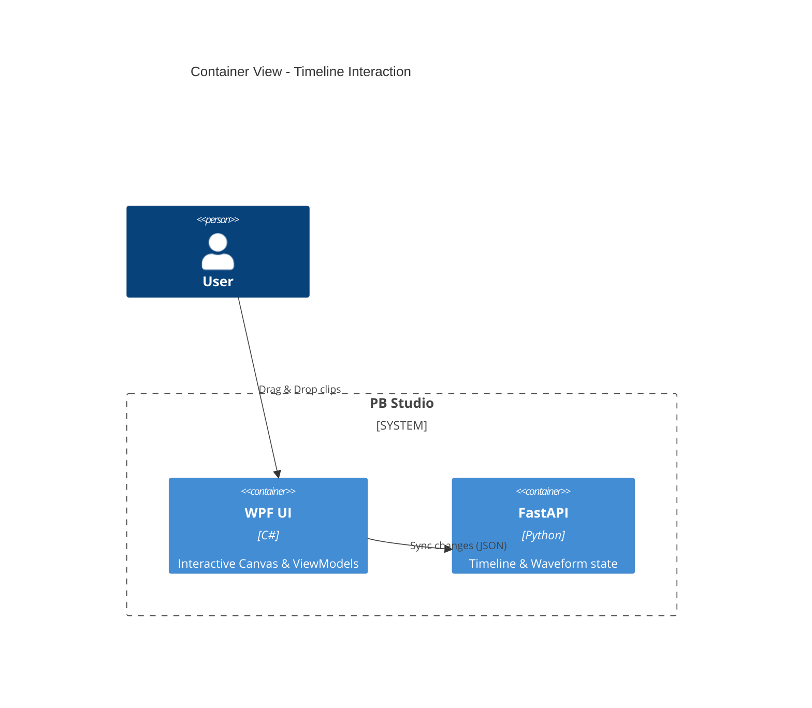

# Implementation Plan: Interactive Power-Timeline

**Branch**: `00005-power-timeline` | **Date**: 2026-04-24 | **Spec**: [spec.md](spec.md)

## Summary

**Goal**: Implement a vollwertige interactive timeline for manual adjustment of video cuts.  
**Approach**: Use a Canvas-based WPF view with a custom Zoom/PixelsPerSecond scaling logic and drag-and-drop mouse handling.  
**Key Constraint**: Performance — must handle thousands of waveform points and hundreds of clips without UI freezing.

## Technical Context

**Language/Version**: Python 3.11, C# (.NET 9)  
**Primary Dependencies**: FastAPI, WPF, CommunityToolkit.Mvvm, MaterialDesignInXaml<br>
**Storage**: JSON project files (backend)  
**Testing**: pytest (Backend), dotnet test (Frontend), pywinauto (E2E)<br>
**Target Platform**: Windows Desktop
**Project Type**: hybrid
**Project Mode**: brownfield
**Performance Goals**: 60 FPS UI during timeline scrolling and interaction.
**Constraints**: local-only; AMD DirectML support.
**Scale/Scope**: Up to 4-hour timelines.

## Instructions Check

*GATE: Must pass before Phase 0 research. Re-check after Phase 1 design.*

- **AMD DirectML First**: ✅ PASS. UI is decoupled from hardware details.
- **Offline First**: ✅ PASS. No cloud dependencies.
- **Quality Over Speed**: ✅ PASS. Focus on frame-accurate manual editing.
- **Agent Output Style**: ✅ PASS. Plan is concise and structured.

## Architecture



## Architecture Decisions

| ID | Decision | Options Considered | Chosen | Rationale |
|----|----------|--------------------|--------|-----------|
| AD-001 | Scaling Logic | Fixed pixels vs. Dynamic PPS | Dynamic PixelsPerSecond | Allows smooth zooming and frame-accurate positioning. |
| AD-002 | Rendering | ListView vs. Canvas | ItemsControl with Canvas | Necessary for precise X-positioning and overlapping layers (Waveform/Clips). |
| AD-003 | Waveform Optimization | Raw points vs. Aggregated | Aggregated (~1000 points) | Essential to prevent UI freezes on long mixes. |

## Data Model Summary

N/A — no persistent data (reusing existing TimelineEntry and WaveformBarModel).

## API Surface Summary

N/A — no new API surface (reusing /audio/waveform and /project/timeline).

## Testing Strategy

| Tier | Tool | Scope | Mock Boundary | Install |
|------|------|-------|---------------|---------|
| Unit | dotnet test | ViewModel logic & Converters | Mock ApiClient | configured |
| Integration | pywinauto | Mouse drag/drop interaction | Real backend | configured |
| Security | N/A | — | — | — |
| Coverage | N/A | — | — | — |

## Error Handling Strategy

| Error Category | Pattern | Response | Retry |
|----------------|---------|----------|-------|
| API Disconnect | Reconnection | Show "Backend lost" in status | yes, auto |
| Data Drift | Conflict Detection | Warn user if backend state differs | no, manual sync |

## Risk Mitigation

| Risk (from spec) | Likelihood | Impact | Mitigation | Owner |
|-------------------|------------|--------|------------|-------|
| UI Performance | Medium | High | Aggregated waveform and virtualized items | WPF Frontend |
| Precision Drift | Low | Medium | High-precision double for time-to-pixel math | Converters |

## Requirement Coverage Map

| Req ID | Component(s) | File Path(s) | Notes |
|--------|--------------|--------------|-------|
| FR-001 | TimelineView | PBStudio.UI/Views/TimelineView.xaml | Canvas-based rendering |
| FR-002 | TimelineViewModel | PBStudio.UI/ViewModels/TimelineViewModel.cs | Aggregated waveform loading |
| FR-003 | TimelineView.xaml.cs | PBStudio.UI/Views/TimelineView.xaml.cs | Mouse drag-and-drop logic |
| FR-004 | TimelineView.xaml.cs | PBStudio.UI/Views/TimelineView.xaml.cs | Edge-based trimming logic |
| FR-005 | TimelineView | PBStudio.UI/Views/TimelineView.xaml | Zoom slider and RulerCanvas |
| FR-006 | TimelineView.xaml.cs | PBStudio.UI/Views/TimelineView.xaml.cs | Playhead sync with MediaElement |

## Project Structure

### Source Code

```text
~ PBStudio.UI/
  ~ ViewModels/
    ~ TimelineViewModel.cs
  ~ Views/
    ~ TimelineView.xaml
    ~ TimelineView.xaml.cs
  + Models/
    + WaveformBarModel.cs
  + Converters/
    + TimeToPixelConverter.cs
```

**Patterns to reuse**: MVVM (CommunityToolkit), MaterialDesign styling.
**Tests to extend**: Add E2E tests in `Tests/test_9_views.py` (or new test).
**Naming conventions**: PascalCase for C#, snake_case for Python.

## Implementation Hints

- **[HINT-001]** UI: Ensure `Canvas.Left` and `Width` multi-bindings use the same `PixelsPerSecond` property for consistency.
- **[HINT-002]** Interaction: Call `CaptureMouse()` during dragging to prevent lost focus outside the window.
- **[HINT-003]** Performance: Do not update the full collection on every mouse move; update the model property and use `NotifyPositionChanged`.

## Compliance Check

- **AMD DirectML First**: ? PASS.
- **Offline First**: ? PASS.
- **Quality Over Speed**: ? PASS. Performance optimizations for large timelines are planned.
- **Agent Output Style**: ? PASS. Plan follows structured, concise format.
