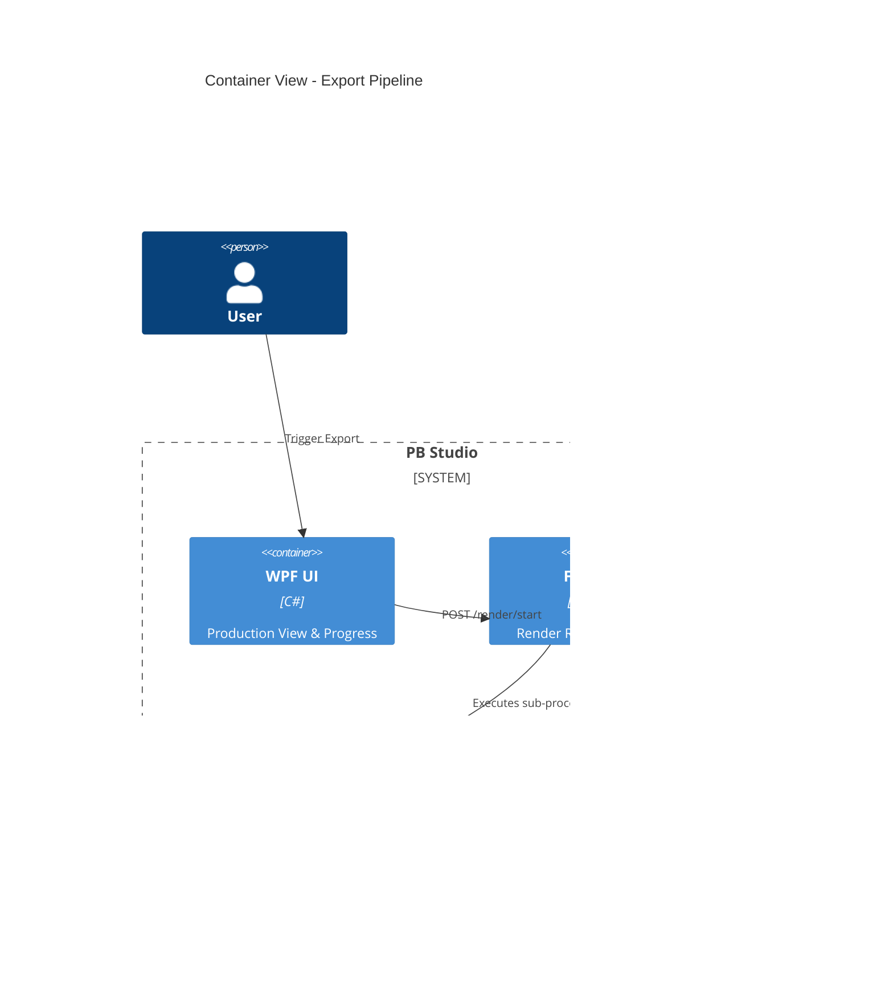

# Implementation Plan: AMD Export Pipeline

**Branch**: `00006-amd-export-pipeline` | **Date**: 2026-04-24 | **Spec**: [spec.md](spec.md)

## Summary

**Goal**: Implement a high-performance video export pipeline leveraging AMD AMF hardware acceleration.  
**Approach**: Refine the existing `RenderService` to handle multi-clip concatenation via FFmpeg's concat protocol, utilizing `h264_amf` or `hevc_amf` encoders for speed and accuracy.  
**Key Constraint**: Correctness of visual cuts and perfect audio/video synchronization.

## Technical Context

**Language/Version**: Python 3.11, C# (.NET 9)  
**Primary Dependencies**: FastAPI, FFmpeg (with AMF support), DirectML<br>
**Storage**: N/A (Transient processing)  
**Testing**: pytest (unit/integration), verify_release_smoke.ps1 (E2E)<br>
**Target Platform**: Windows 10/11 Desktop
**Project Type**: hybrid
**Project Mode**: brownfield
**Performance Goals**: 3x speedup over CPU encoding; < 33ms sync drift.
**Constraints**: AMD DirectML/AMF priority; offline-first.

## Instructions Check

- **AMD DirectML First**: ✅ PASS. Built around AMF encoders.
- **Offline First**: ✅ PASS. Local processing only.
- **Quality Over Speed**: ✅ PASS. Sync drift target is frame-accurate.
- **Agent Output Style**: ✅ PASS. Plan is concise.

## Architecture



## Architecture Decisions

| ID | Decision | Options Considered | Chosen | Rationale |
|----|----------|--------------------|--------|-----------|
| AD-001 | Concatenation Method | Re-encode vs. Concat Protocol | FFmpeg Concat Protocol | Allows for mixed-source normalization followed by a single high-speed AMF encode pass. |
| AD-002 | Encoder Selection | Auto-detect vs. Manual | Progressive Detection | Checks for `hevc_amf`, then `h264_amf`, then `h264_mf`, with CPU fallback. |
| AD-003 | Progress Tracking | Log parsing vs. -progress flag | Stderr parsing with Regex | Provides high-frequency FPS and time updates for the live telemetry requirement. |

## Data Model Summary

N/A — reuses existing `RenderRequest` and `TimelineEntry` snapshots.

## API Surface Summary

N/A — uses existing `/render/start`, `/render/status`, `/render/cancel`.

## Testing Strategy

| Tier | Tool | Scope | Mock Boundary | Install |
|------|------|-------|---------------|---------|
| Unit | pytest | RenderService logic | Mock subprocess | configured |
| Integration | pytest | Full render loop | Temp files | configured |
| E2E | powershell | verify_release_smoke.ps1 | Real GPU | configured |

## Error Handling Strategy

| Error Category | Pattern | Response | Retry |
|----------------|---------|----------|-------|
| GPU Timeout (TDR) | Exception Catch | Log detail, notify UI | no (requires user action) |
| FFmpeg Crash | Code Check | Return stderr tail in status | no |

## Risk Mitigation

| Risk (from spec) | Likelihood | Impact | Mitigation | Owner |
|-------------------|------------|--------|------------|-------|
| Driver Incompatibility | Low | High | Pre-check encoder availability via `_detect_best_encoder` | Backend |
| Sync Drift | Medium | Medium | Use `-segment_time_metadata` and explicit frame rates | FFmpeg |

## Requirement Coverage Map

| Req ID | Component(s) | File Path(s) | Notes |
|--------|--------------|--------------|-------|
| FR-001 | RenderService | src/pb_studio/rendering/render_service.py | Multi-encoder support |
| FR-002 | RenderService | src/pb_studio/rendering/render_service.py | Concat list generation |
| FR-003 | RenderRouter | backend/routers/render_router.py | SSE progress events |
| FR-004 | RenderRouter | backend/routers/render_router.py | /cancel endpoint logic |

## Project Structure

### Source Code

```text
~ src/pb_studio/rendering/
  ~ render_service.py
~ backend/routers/
  ~ render_router.py
```

## Implementation Hints

- **[HINT-001]** FFmpeg: Use `-stats_period 0.5` for smooth UI telemetry.
- **[HINT-002]** AMF: Ensure `-quality balanced` is used for optimal speed/quality trade-off on AMD cards.
- **[HINT-003]** Normalization: Perform `fps` conversion before concatenation to avoid global sync issues.

## Compliance Check

- **AMD DirectML First**: ✅ PASS.
- **Offline First**: ✅ PASS.
- **Quality Over Speed**: ✅ PASS.
- **Agent Output Style**: ✅ PASS.
