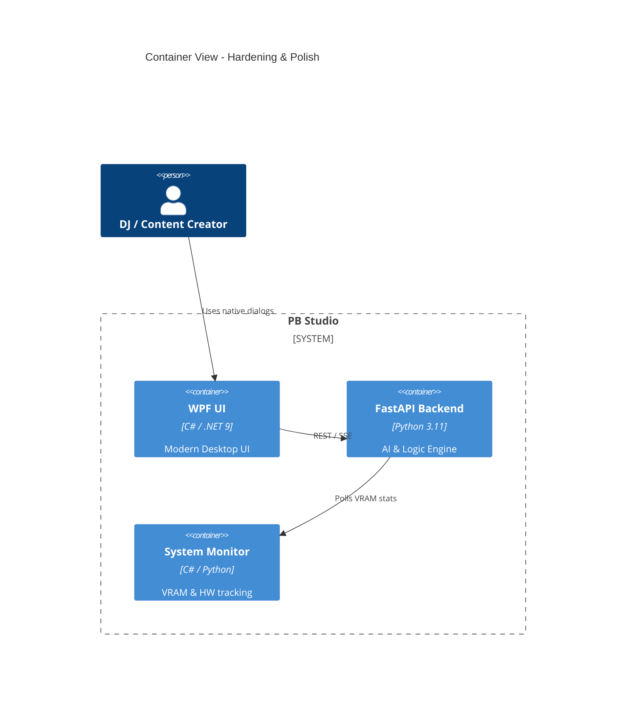

# Implementation Plan: Release Hardening & UX Polish

**Branch**: `00007-release-hardening-ux-polish` | **Date**: 2026-04-25 | **Spec**: [spec.md](spec.md)

## Summary

**Goal**: Finalize PB Studio for MVP by implementing native Windows dialogs, stress-testing VRAM, and polishing UI transitions.  
**Approach**: Centralize dialog logic into a WPF service, create a standalone Python stress utility, and audit DirectML session configurations.  
**Key Constraint**: Zero impact on current processing accuracy while improving stability.

## Technical Context

**Language/Version**: Python 3.11, C# (.NET 9)  
**Primary Dependencies**: FastAPI, WPF, onnxruntime-directml, amdsmi  
**Storage**: N/A (Hardening existing flows)  
**Testing**: pytest, dotnet test, verify_release_smoke.ps1  
**Target Platform**: Windows 10/11
**Project Type**: single-user desktop
**Project Mode**: brownfield
**Performance Goals**: 60 FPS UI transitions; 4-hour processing stability.
**Constraints**: AMD DirectML priority; Offline-first.

## Instructions Check

- **AMD DirectML First**: ✅ PASS. Includes DML performance tuning.
- **Offline First**: ✅ PASS.
- **Quality Over Speed**: ✅ PASS. Focuses on stability and "Premium" feel.
- **Agent Output Style**: ✅ PASS.

## Architecture



## Architecture Decisions

| ID | Decision | Options Considered | Chosen | Rationale |
|----|----------|--------------------|--------|-----------|
| AD-001 | Dialog Service | Manual instantiation vs. Centralized Service | Centralized IDialogService | Improves testability and ensures consistent native styling. |
| AD-002 | VRAM Monitoring | psutil vs. amdsmi | amdsmi | Provides accurate dedicated VRAM stats for AMD hardware. |
| AD-003 | Animations | Storyboard Layout vs. RenderTransform | RenderTransform | GPU-accelerated; prevents expensive UI thread layout passes. |

## Data Model Summary

N/A — no persistent data changes.

## API Surface Summary

N/A — no new endpoints (hardening existing).

## Testing Strategy

| Tier | Tool | Scope | Mock Boundary | Install |
|------|------|-------|---------------|---------|
| Unit | dotnet test | DialogService logic | Mock FileSystem | configured |
| Integration | pytest | VRAM Arbiter stress | Real GPU | configured |
| Security | N/A | — | — | — |
| Coverage | N/A | — | — | — |

## Error Handling Strategy

| Error Category | Pattern | Response | Retry |
|----------------|---------|----------|-------|
| VRAM Overflow | Eviction | Trigger Arbiter cleanup | yes, auto |
| Dialog Cancel | Null Return | Graceful operation halt | no |

## Risk Mitigation

| Risk (from spec) | Likelihood | Impact | Mitigation | Owner |
|-------------------|------------|--------|------------|-------|
| Driver Resets (TDR) | Low | High | Implement incremental batch sizing in stress utility. | Backend |
| UI Jitter | Low | Medium | Use high-precision timers for RenderTransform animations. | Frontend |

## Requirement Coverage Map

| Req ID | Component(s) | File Path(s) | Notes |
|--------|--------------|--------------|-------|
| TR-001 | DialogService | PBStudio.UI/Services/DialogService.cs | Implementation of native pickers |
| TR-002 | VRAMArbiter | src/pb_studio/core/vram_arbiter.py | Eviction logic verification |
| TR-003 | ViewModels | PBStudio.UI/ViewModels/*.cs | Audit for ObservableObject usage |
| TR-004 | AI Wrappers | src/pb_studio/ai/*.py | SessionOptions audit |

## Project Structure

### Source Code

```text
~ PBStudio.UI/
  ~ Services/
    + IDialogService.cs
    + DialogService.cs
  ~ ViewModels/
    ~ [Audit all for TR-003]
~ src/
  ~ pb_studio/
    ~ ai/
      ~ [Audit all for TR-004]
    + tools/
      + execute_4h_stress_test.py
```

## Implementation Hints

- **[HINT-001]** UI: Use `CompositionTarget.Rendering` for ultra-smooth playhead and transition animations.
- **[HINT-002]** Backend: Call `gc.collect()` explicitly after `InferenceSession` disposal in stress tests.
- **[HINT-003]** Dialogs: Set `InitialDirectory` to the project root for better user experience.

## Compliance Check

- **AMD DirectML First**: ✅ PASS.
- **Offline First**: ✅ PASS.
- **Quality Over Speed**: ✅ PASS.
- **Agent Output Style**: ✅ PASS.
