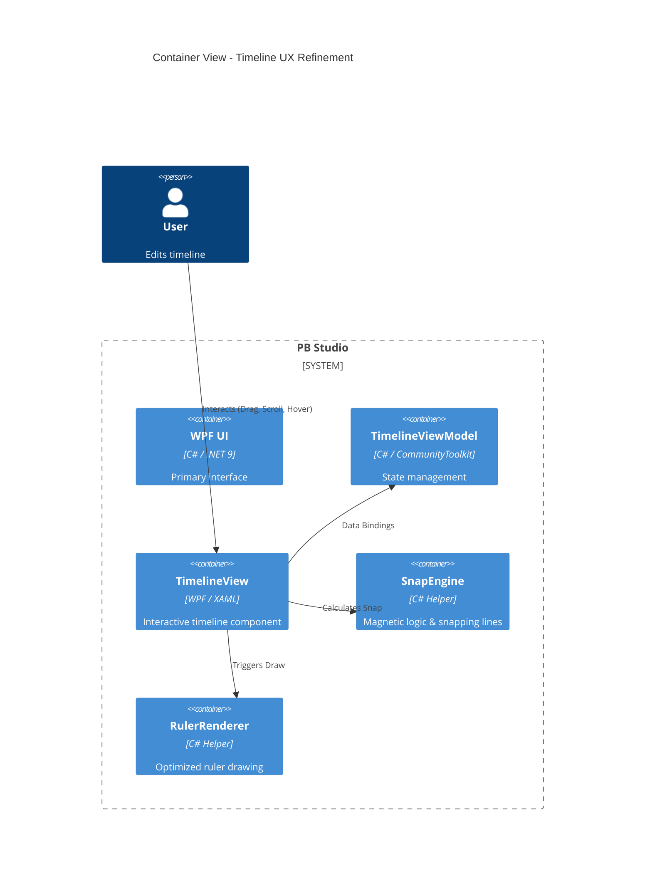

# Technical Plan: Deeper UX & Timeline Polish

**Feature Branch**: `00008-deeper-ux-timeline-polish`  
**Created**: 2026-05-07  
**Spec Maturity**: clarified

## Technical Context

- **Language/Version**: C# (.NET 9), Python 3.11
- **Primary Frameworks**: WPF, CommunityToolkit.Mvvm, MaterialDesignInXaml
- **Project Mode**: Brownfield (extending existing `PBStudio.UI`)
- **UI Platform**: Windows Desktop (Desktop-native)
- **Performance Mandates**: 60fps scrolling, <100ms interaction feedback

## Architecture Decisions

| ID | Decision | Rationale |
|----|----------|-----------|
| AD-001 | Pixel-Based UI Virtualization | `VirtualizingPanel.ScrollUnit="Pixel"` is required for smooth, non-jumping navigation in long media projects. |
| AD-002 | VSM-Driven Interaction States | Using `VisualStateManager` ensures hardware-accelerated transitions and clean separation of UI states (Hover, Selection). |
| AD-003 | Client-Side SnapEngine | Logic for magnetic snapping must reside in the UI layer for sub-10ms responsiveness. |
| AD-004 | Cached Ruler Drawing | Procedural drawing of the ruler on a `DrawingVisual` or cached `Canvas` prevents UI freezes during zoom/scroll. |

## Architecture



## Data Model Summary
N/A — no new persistent data entities; uses existing `TimelineEntryModel`.

## API Surface Summary
N/A — UI-only refinement; no new backend API endpoints required.

## Source Code Structure

**Brownfield Notes**: Enhancing `PBStudio.UI/Views/TimelineView.xaml` and related logic.

```text
PBStudio.UI/
├── Views/
│   ├── TimelineView.xaml        ~ (Virtualization, Ruler, Snap Overlay)
│   └── TimelineView.xaml.cs     ~ (SnapEngine integration, VSM triggers)
├── ViewModels/
│   └── TimelineViewModel.cs     ~ (Snapping threshold config, snap markers)
└── Helpers/
    ├── SnapEngine.cs            + (New: Snapping calculation logic)
    └── RulerRenderer.cs         + (New: Optimized ruler drawing)
```

## Testing Strategy

| Tier | Tool | Scope | Mock Boundary | Install |
|------|------|-------|---------------|---------|
| Unit | xUnit | SnapEngine logic, ViewModel state | N/A | configured |
| UI/Manual | Manual | Scrolling fluidity, VSM transitions | Backend (use mock) | N/A |
| E2E | pywinauto | Selection consistency across views | Full App | configured |

## Error Handling Strategy
N/A — UI-only refinement; errors in snapping logic result in fallback to free-dragging (non-critical).

## Integration Points

| Integration | Approach |
|-------------|----------|
| Beat/Onset Markers | Consumed from `TimelineViewModel.SnapMarkers` provided by backend analysis. |
| Zoom (PPS) | Unified via `TimelineState` service for consistent scaling across components. |

## Risk Mitigation

| Risk | Mitigation |
|------|------------|
| Virtualization Jitter | Use `VirtualizingPanel.CacheLength` to pre-render clips near the viewport. |
| Snap Priority Conflict | Explicit priority order: Playhead > Beat > Onset > Edge (STF-001). |
| Binding Bottleneck | Minimize MultiBindings; calculate pixel positions in `SnapEngine` if needed. |

## Requirement Coverage Map

| ID | Description | Component(s) | File Path(s) |
|----|-------------|--------------|--------------|
| FR-001 | Pixel scrolling | TimelineView | `PBStudio.UI/Views/TimelineView.xaml` |
| FR-002 | UI Recycling | TimelineView | `PBStudio.UI/Views/TimelineView.xaml` |
| FR-003 | Snap Threshold | SnapEngine | `PBStudio.UI/Helpers/SnapEngine.cs` |
| FR-004 | Snap Line | TimelineView | `PBStudio.UI/Views/TimelineView.xaml` |
| FR-005 | SHIFT Override | TimelineView | `PBStudio.UI/Views/TimelineView.xaml.cs` |
| FR-006 | Cached Ruler | RulerRenderer | `PBStudio.UI/Helpers/RulerRenderer.cs` |
| FR-007 | VSM States | TimelineView | `PBStudio.UI/Views/TimelineView.xaml` |

## Implementation Hints

- **[HINT-001]** Performance: Set `VirtualizingPanel.VirtualizationMode="Recycling"` on the `ItemsControl` hosting clips.
- **[HINT-002]** UX: Vertical snap lines should be rendered on a separate `Canvas` layer above clips for clear visibility.
- **[HINT-003]** Logic: The `SnapEngine` should use the current Zoom factor (PixelsPerSecond) to convert pixel thresholds to time thresholds.
