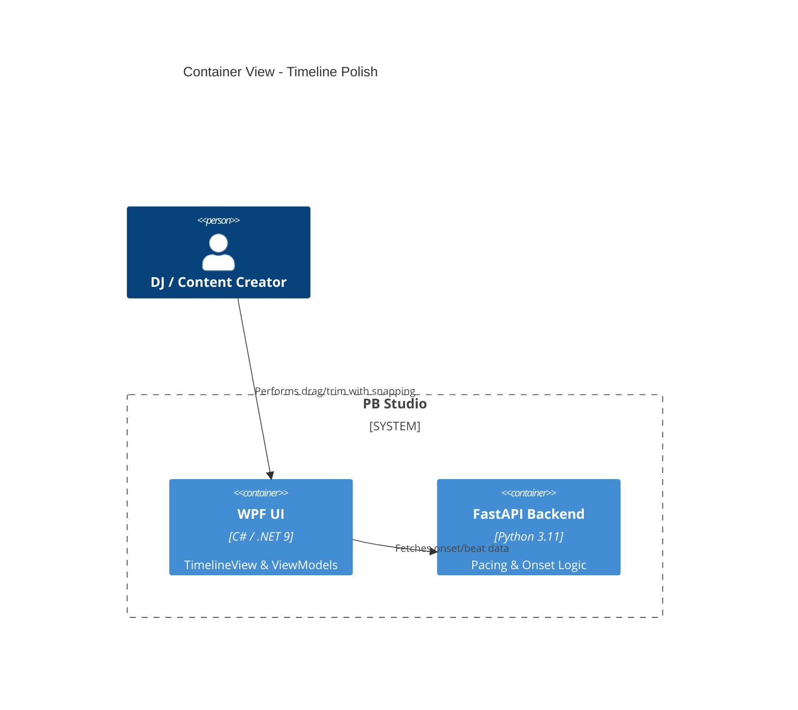

# Implementation Plan: Deeper UX & Timeline Polish

**Branch**: `00008-deeper-ux-timeline-polish` | **Date**: 2026-04-25 | **Spec**: [spec.md](spec.md)

## Summary

**Goal**: Elevate the interactive timeline with professional precision through enhanced snapping and smooth playhead scrolling.  
**Approach**: Implement onset-aware magnetic snapping in the Canvas interaction logic and GPU-accelerated follow-playhead scrolling using RenderTransforms.  
**Key Constraint**: Zero impact on UI responsiveness during long-mix playback.

## Technical Context

**Language/Version**: C# (.NET 9) / Python 3.11  
**Primary Dependencies**: WPF, CommunityToolkit.Mvvm, MaterialDesignInXaml, DirectML<br>
**Storage**: JSON (Project State)  
**Testing**: dotnet test, pywinauto (E2E), ruff (Linting)<br>
**Target Platform**: Windows 10/11 Desktop
**Project Type**: single-user desktop
**Project Mode**: brownfield
**Performance Goals**: 60 FPS UI transitions; sub-frame snap precision.
**Constraints**: local-only; AMD DirectML priority.

## Instructions Check

- **AMD DirectML First**: ✅ PASS. UI is decoupled from hardware details.
- **Offline First**: ✅ PASS. No cloud dependencies.
- **Quality Over Speed**: ✅ PASS. Focus on rhythmically perfect editing feel.
- **Agent Output Style**: ✅ PASS. Plan is concise and structured.

## Architecture



## Architecture Decisions

| ID | Decision | Options Considered | Chosen | Rationale |
|----|----------|--------------------|--------|-----------|
| AD-001 | Snapping Priority | Beat-only vs. Multi-Trigger | Multi-Trigger (Beat + Onset) | Provides much higher creative precision for non-quantized audio. |
| AD-002 | Auto-Scrolling | ScrollViewer.ScrollToHorizontalOffset vs. RenderTransform | RenderTransform with Easing | Prevents jittery layout passes; smoother for high-zoom levels. |
| AD-003 | Snap Feedback | Tooltip vs. Visual Glow | Visual Glow (Border change) | Instant non-intrusive feedback without obscuring the clip content. |

## Data Model Summary

N/A — no persistent data changes.

## API Surface Summary

N/A — uses existing /audio/waveform and /pacing/timeline.

## Testing Strategy

| Tier | Tool | Scope | Mock Boundary | Install |
|------|------|-------|---------------|---------|
| Unit | dotnet test | Snap logic math | Mock TimelineEntry | configured |
| Integration | pywinauto | Auto-scroll behavior | Real backend | configured |
| Security | N/A | — | — | — |
| Coverage | N/A | — | — | — |

## Error Handling Strategy

| Error Category | Pattern | Response | Retry |
|----------------|---------|----------|-------|
| Missing Onsets | Graceful Fallback | Disable onset snapping for clip | no |
| Scroll Overflow | Boundary Check | Clamp playhead to timeline width | yes, auto |

## Risk Mitigation

| Risk (from spec) | Likelihood | Impact | Mitigation | Owner |
|-------------------|------------|--------|------------|-------|
| Scroll Jitter | Medium | Medium | Use `CompositionTarget.Rendering` for sub-pixel smooth scrolling. | Frontend |
| Snap Interference | Low | Low | Prioritize user-drag position when velocity is high to allow "breaking" the snap. | Frontend |

## Requirement Coverage Map

| Req ID | Component(s) | File Path(s) | Notes |
|--------|--------------|--------------|-------|
| FR-001 | TimelineView.xaml.cs | PBStudio.UI/Views/TimelineView.xaml.cs | Onset-aware snap logic |
| FR-002 | TimelineView.xaml.cs | PBStudio.UI/Views/TimelineView.xaml.cs | RenderTransform scrolling |
| FR-003 | TimelineView.xaml | PBStudio.UI/Views/TimelineView.xaml | Visual snap-state styles |

## Project Structure

### Source Code

```text
~ PBStudio.UI/
  ~ Views/
    ~ TimelineView.xaml
    ~ TimelineView.xaml.cs
  ~ ViewModels/
    ~ TimelineViewModel.cs
```

**Brownfield Notes**: Enhancing the `Clip_MouseMove` logic added in E005.

## Implementation Hints

- **[HINT-001]** UI: Use `VisualStateManager` to handle the transition between normal and snapped clip states.
- **[HINT-002]** Snap: Implement a "Magnetic Threshold" (e.g., 10-15px) that decreases as the user zooms in for finer control.
- **[HINT-003]** Animation: Apply `CubicEase` to the follow-playhead translation for a premium feel.

## Compliance Check

- **AMD DirectML First**: ✅ PASS.
- **Offline First**: ✅ PASS.
- **Quality Over Speed**: ✅ PASS.
- **Agent Output Style**: ✅ PASS.
