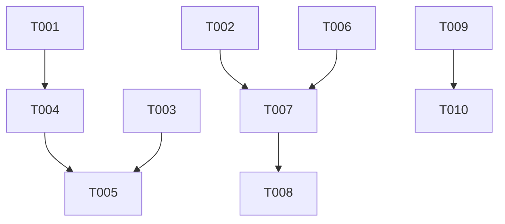

# Tasks: Deeper UX & Timeline Polish

## Work Item Checklist

### Setup & Foundation
- [X] T001 [P1] Configure basic UI virtualization properties in `TimelineView.xaml` (FR-001, FR-002)
- [X] T002 [P1] Implement `SnapEngine.cs` helper for magnetic calculation (FR-003)
- [X] T003 [P1] Implement `RulerRenderer.cs` for cached procedural drawing (FR-006)

### US1 — Fluid Scrolling
- [X] T004 [P1] Integrate Pixel-based virtualization with `TimelineItemsControl` (FR-001) [COMPLETES FR-001]
- [X] T005 [P2] Refactor `TimelineViewModel` to support high-frequency virtualization (SC-001)

### US2 — Precision Snapping
- [X] T006 [P1] Implement vertical Snap Line overlay in `TimelineView.xaml` (FR-004)
- [X] T007 [P1] Integrate `SnapEngine` into `Clip_MouseMove` and `Clip_MouseDown` (FR-003, SC-002) [COMPLETES FR-003]
- [X] T008 [P2] Add `SHIFT` key modifier detection for snap override (FR-005)

### US3 — Interaction States & Accessibility
- [X] T009 [P2] Update `ClipBorder` VSM states (Normal, MouseOver, Selected) with glow effects (FR-007)
- [X] T010 [P2] Implement high-contrast indicators for accessibility (FR-008)

## Task Details

### T001 — Configure UI Virtualization
- **Priority**: P1
- **Status**: todo
- **Requirement**: FR-001, FR-002
- **Description**: Set `VirtualizingPanel.IsVirtualizing="True"`, `VirtualizingPanel.VirtualizationMode="Recycling"`, and `VirtualizingPanel.ScrollUnit="Pixel"` on the main `ItemsControl` and its `ScrollViewer`.

### T002 — SnapEngine Helper
- **Priority**: P1
- **Status**: todo
- **Requirement**: FR-003
- **Description**: Create `PBStudio.UI/Helpers/SnapEngine.cs`. Implement logic to find the closest `SnapPoint` within a pixel threshold. Priority: Playhead > Beat > Onset > Edge.

### T003 — RulerRenderer Helper
- **Priority**: P1
- **Status**: todo
- **Requirement**: FR-006
- **Description**: Create `PBStudio.UI/Helpers/RulerRenderer.cs`. Implement a drawing-based approach (using `DrawingContext`) to render the timeline ruler, caching results to avoid layout thrashing on zoom.

### T007 — Snapping Integration
- **Priority**: P1
- **Status**: todo
- **Requirement**: FR-003, SC-002
- **Description**: Replace hardcoded snapping in `TimelineView.xaml.cs` with `SnapEngine`. Trigger the visual "Snap Line" overlay when a snap is detected.

## Dependency Graph

