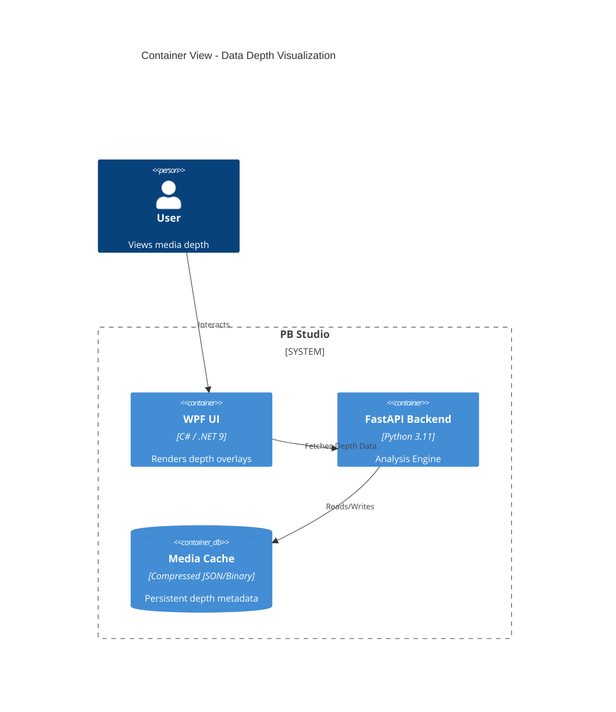

# Technical Plan: Audio/Video Data Depth

**Feature Branch**: `00009-data-depth-visualization`  
**Created**: 2026-05-07  
**Spec Maturity**: clarified

## Technical Context

- **Language/Version**: C# (.NET 9), Python 3.11
- **Primary Frameworks**: WPF, FastAPI, Librosa, NumPy
- **Project Mode**: Brownfield (extending existing `PBStudio.UI` and `backend`)
- **UI Platform**: Windows Desktop
- **Performance Mandates**: 60fps UI, <0.5x analysis speed

## Architecture Decisions

| ID | Decision | Rationale |
|----|----------|-----------|
| AD-001 | Librosa MSA Pipeline | Librosa is the industry standard for Python MSA. It provides robust SSM and chroma extraction for section detection. |
| AD-002 | Compressed Spectral Cache | Spectral data can reach several megabytes for long tracks. Compression in `media_cache` prevents `project.json` bloat (STF-002). |
| AD-003 | DrawingVisual Rendering | `DrawingVisual` is significantly more performant than `Path` or `Polyline` elements for rendering high-density data curves (TR-001). |
| AD-004 | Dynamic Downsampling | Viewport-aware downsampling in the ViewModel ensures that we only process/draw relevant data points for the current zoom level (STF-001). |

## Architecture



## Data Model Summary

### SongSegment (Backend & Frontend)
- `StartTime`: double (seconds)
- `EndTime`: double (seconds)
- `Label`: string (Intro, Chorus, etc.)
- `EnergyScore`: double (0.0 - 1.0)

### SpectralData (Backend & Frontend)
- `Timestamps`: double[]
- `CentroidValues`: double[]
- `EnergyValues`: double[]

## API Surface Summary

### GET /audio/depth/{media_id}
Returns `SongSegments` and `SpectralData` for a specific audio file.

### POST /audio/analyze-depth/{media_id}
Triggers high-resolution depth analysis (MSA + Spectral).

## Source Code Structure

```text
backend/
├── routers/
│   └── audio_router.py          ~ (Add depth analysis endpoints)
├── schemas/
│   └── audio_schemas.py        + (Add SongSegment, SpectralData models)
└── logic/
    └── music_analysis.py       + (New: Librosa MSA & Spectral extraction)

PBStudio.UI/
├── ViewModels/
│   └── TimelineViewModel.cs     ~ (Add Depth collections, downsampling logic)
├── Views/
│   └── TimelineView.xaml        ~ (Add DepthLayer Canvas)
└── Controls/
    └── DepthRenderer.cs         + (New: Custom drawing for spectral curves)
```

## Testing Strategy

| Tier | Tool | Scope | Mock Boundary | Install |
|------|------|-------|---------------|---------|
| Unit | pytest | MSA logic, Spectral extraction | Librosa mock | configured |
| Unit | xUnit | Downsampling logic | N/A | configured |
| UI/Manual | Manual | Overlay alignment, FPS check | Backend mock | N/A |

## Error Handling Strategy
- **Backend**: Wrap Librosa calls in try-except; return `HTTP 500` with detailed logs if analysis fails.
- **Frontend**: Handle `null` depth data by hiding overlays and showing a status indicator.

## Integration Points
- **Media Cache**: Depth data must be indexed by `media_hash` for fast lookup.
- **Zoom Property**: `TimelineViewModel.Zoom` must trigger re-downsampling of spectral curves.

## Risk Mitigation

| Risk | Mitigation |
|------|------------|
| Memory Overload | Perform Librosa analysis in chunks of 5 minutes. |
| UI Jitter | Use `CompositionTarget.Rendering` for smooth scroll-sync of overlays. |
| Model Size | Use small, pre-trained MSA models (if deep learning is used) or stay with feature-based MSA. |

## Requirement Coverage Map

| ID | Description | Component(s) | File Path(s) |
|----|-------------|--------------|--------------|
| FR-001 | Spectral Extraction | Backend Analysis | `backend/logic/music_analysis.py` |
| FR-002 | Song Section Detection | Backend MSA | `backend/logic/music_analysis.py` |
| FR-003 | Section Rendering | TimelineView | `PBStudio.UI/Views/TimelineView.xaml` |
| FR-004 | Adaptive Scene Detection | Backend Video | `backend/logic/video_analysis.py` |
| FR-005 | Metadata Persistence | Media Cache | `backend/logic/storage.py` |
| TR-001 | DrawingVisual Performance | DepthRenderer | `PBStudio.UI/Controls/DepthRenderer.cs` |
| TR-002 | Chunked Analysis | Backend Analysis | `backend/logic/music_analysis.py` |

## Implementation Hints
- **[HINT-001]** Use `librosa.effects.remix` or similar to handle silence at song boundaries during MSA.
- **[HINT-002]** In WPF, `VisualTreeHelper.HitTest` might be needed if depth overlays need to be interactive (e.g. clicking a segment to seek).
- **[HINT-003]** Use `System.IO.Compression` on the C# side if reading raw binary spectral caches.
