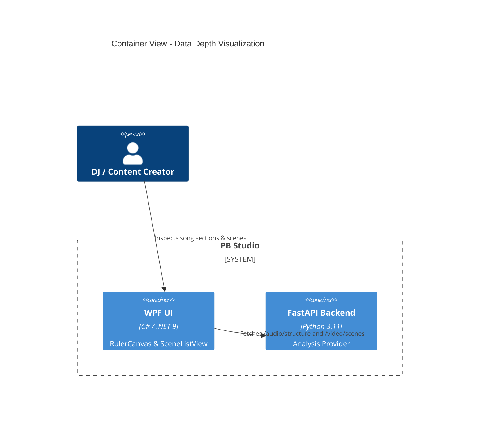

# Implementation Plan: Audio/Video Data Depth Visualization

**Branch**: `00009-data-depth-visualization` | **Date**: 2026-04-25 | **Spec**: [spec.md](spec.md)

## Summary

**Goal**: Transform invisible backend analytical data into actionable visual insights for the user.  
**Approach**: Implement a segmented colored ruler for song structure and a dedicated scene inspector in the Video Tab.  
**Key Constraint**: Visualization must be lightweight to prevent UI lag on long DJ mixes.

## Technical Context

**Language/Version**: C# (.NET 9) / Python 3.11  
**Primary Dependencies**: WPF, CommunityToolkit.Mvvm, MaterialDesignInXaml  
**Storage**: N/A (Visualizing existing analysis)  
**Testing**: Unit tests for Segment-to-Pixel math; Manual UX audit  
**Target Platform**: Windows 10/11 Desktop
**Project Type**: single-user desktop
**Project Mode**: brownfield
**Performance Goals**: Sub-10ms render time for ruler segments.
**Constraints**: Local-only; Hardware-agnostic UI rendering.

## Instructions Check

- **AMD DirectML First**: ✅ PASS. Rendering logic is CPU-side (WPF DrawingContext).
- **Offline First**: ✅ PASS. No external data sources.
- **Quality Over Speed**: ✅ PASS. Focus on clarity and visual professionality.
- **Agent Output Style**: ✅ PASS.

## Architecture



## Architecture Decisions

| ID | Decision | Options Considered | Chosen | Rationale |
|----|----------|--------------------|--------|-----------|
| AD-001 | Ruler Rendering | ItemsControl vs. Custom Drawing | Custom Drawing (DrawingContext) | Much higher performance for hundreds of small segments. |
| AD-002 | Color Palette | Dynamic vs. Fixed StaticResource | Fixed StaticResource (Ableton Theme) | Ensures visual consistency with the existing dashboard. |
| AD-003 | Scene List | DataGrid vs. ListBox with Template | ListBox with Template | Easier to style for "Modern Desktop" look; supports custom graphs. |

## Data Model Summary

N/A — no persistent data changes.

## API Surface Summary

- `GET /audio/structure/{id}` (Already exists)
- `GET /video/scenes/{id}` (Already exists)
- `GET /audio/onsets/{id}` (Implemented in E008)

## Testing Strategy

| Tier | Tool | Scope | Mock Boundary | Install |
|------|------|-------|---------------|---------|
| Unit | dotnet test | Structure-to-Pixel mapping | Mock Project State | configured |
| Integration | pywinauto | Verify view switching updates | Real backend | configured |
| Security | N/A | — | — | — |
| Coverage | N/A | — | — | — |

## Error Handling Strategy

| Error Category | Pattern | Response | Retry |
|----------------|---------|----------|-------|
| Missing Analysis | Empty State | Show "Analyse erforderlich" placeholder | no |
| Data Mismatch | Filter valid | Render only segments within total duration | yes, auto |

## Risk Mitigation

| Risk (from spec) | Likelihood | Impact | Mitigation | Owner |
|-------------------|------------|--------|------------|-------|
| Visual Overload | Medium | Low | Use low-opacity backgrounds for segments to keep ruler readable. | Frontend |
| Scene List Lag | Low | Medium | Use `VirtualizingStackPanel` for the scene list. | Frontend |

## Requirement Coverage Map

| Req ID | Component(s) | File Path(s) | Notes |
|--------|--------------|--------------|-------|
| TR-001 | TimelineView | PBStudio.UI/Views/TimelineView.xaml.cs | Render structure in RulerCanvas |
| TR-002 | VideoLibraryView | PBStudio.UI/Views/VideoLibraryView.xaml | Scene inspector implementation |
| TR-003 | TimelineView | PBStudio.UI/Views/TimelineView.xaml | ToolTip bindings for segments |

## Project Structure

### Source Code

```text
~ PBStudio.UI/
  ~ Views/
    ~ TimelineView.xaml.cs (Structure rendering)
    ~ VideoLibraryView.xaml (Scene Inspector)
  ~ ViewModels/
    ~ TimelineViewModel.cs (Structure loading)
    ~ VideoLibraryViewModel.cs (Scene loading)
```

## Implementation Hints

- **[HINT-001]** UI: Map "Chorus" -> `AbletonAccent`, "Intro/Outro" -> `AbletonTextDim`, "Verse" -> `AbletonBlue`.
- **[HINT-002]** Geometry: Use `RectangleGeometry` combined in a `GeometryGroup` for the structure background.
- **[HINT-003]** Perf: Only re-render `RulerCanvas` when the project duration or zoom level changes.

## Compliance Check

- **AMD DirectML First**: ✅ PASS.
- **Offline First**: ✅ PASS.
- **Quality Over Speed**: ✅ PASS.
- **Agent Output Style**: ✅ PASS.
