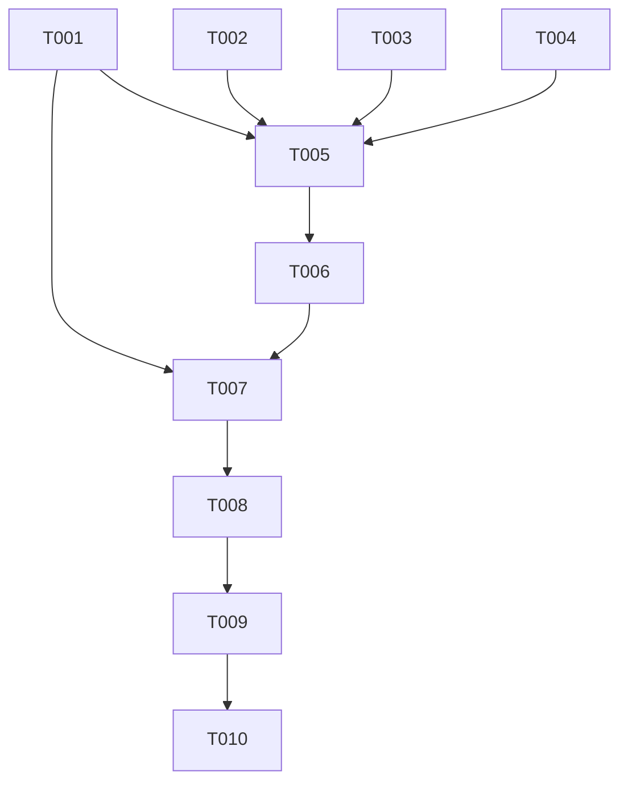

# Tasks: Audio/Video Data Depth

## Work Item Checklist

### Backend — Foundation & Logic
- [ ] T001 [P1] Create `audio_schemas.py` depth models (SongSegment, SpectralData). (FR-001, FR-002)
- [ ] T002 [P1] Implement `music_analysis.py` logic for Librosa MSA (Section Detection). (FR-002, TR-002)
- [ ] T003 [P1] Implement `music_analysis.py` logic for Spectral extraction (Centroid, RMS). (FR-001, TR-002)
- [ ] T004 [P1] Implement adaptive threshold logic in `video_analysis.py` (FR-004, TR-003).

### Backend — API & Storage
- [ ] T005 [P1] Implement `GET /audio/depth/{media_id}` and `POST /audio/analyze-depth/{media_id}` endpoints. (FR-001, FR-002) [COMPLETES FR-001, FR-002]
- [ ] T006 [P1] Extend `storage.py` to handle compressed depth metadata in `media_cache` (FR-005, AD-002).

### Frontend — ViewModel & Foundation
- [ ] T007 [P1] Update `TimelineViewModel.cs` with `SongSegments` and `SpectralData` collections.
- [ ] T008 [P1] Implement dynamic downsampling logic in `TimelineViewModel.cs` (AD-004, STF-001).

### Frontend — UI & Rendering
- [ ] T009 [P1] Create `DepthRenderer.cs` using `DrawingVisual` for high-performance curves (TR-001).
- [ ] T010 [P1] Add `DepthLayer` and `SongSectionLayer` to `TimelineView.xaml` (FR-003).

## Task Details

### T002 — Librosa MSA Logic
- **Priority**: P1
- **Status**: todo
- **Requirement**: FR-002, TR-002
- **Description**: Use `librosa.segment.recurrence_matrix` or chroma clustering to detect Intro, Verse, Chorus, Outro. Ensure chunked processing for memory safety.

### T006 — Compressed Metadata Storage
- **Priority**: P1
- **Status**: todo
- **Requirement**: FR-005, AD-002
- **Description**: Implement zlib compression for spectral arrays before saving to `.cache` files. Index by media hash.

### T009 — DrawingVisual Renderer
- **Priority**: P1
- **Status**: todo
- **Requirement**: TR-001
- **Description**: Override `OnRender` in a custom WPF control to draw the energy curve using `DrawingContext.DrawGeometry`. Use `StreamGeometry` for performance.

## Dependency Graph

