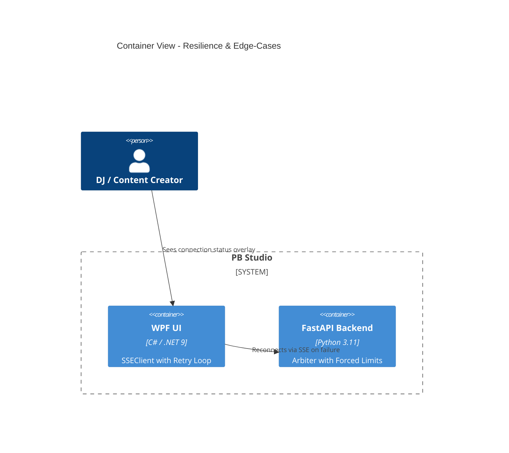

# Implementation Plan: Resilience & Edge-Cases

**Branch**: `00010-resilience-edge-cases` | **Date**: 2026-04-25 | **Spec**: [spec.md](spec.md)

## Summary

**Goal**: Hardened the connection stability between WPF and FastAPI and verify system behavior under extreme VRAM pressure.  
**Approach**: Implement a robust retry-with-backoff loop in the C# SSEClient and create a specialized "Low VRAM" stress test mode in the Python arbiter.  
**Key Constraint**: Zero cloud failover; all resilience logic must be strictly local.

## Technical Context

**Language/Version**: C# (.NET 9) / Python 3.11  
**Primary Dependencies**: WPF, FastAPI, onnxruntime-directml, psutil  
**Storage**: N/A  
**Testing**: Integration test for SSE Reconnect; 4GB Capped Stress Test  
**Target Platform**: Windows 10/11 Desktop
**Project Type**: single-user desktop
**Project Mode**: brownfield
**Performance Goals**: Reconnect within 30s; 0 OOM crashes.
**Constraints**: local-only; AMD DirectML priority.

## Instructions Check

- **AMD DirectML First**: ✅ PASS. Includes low-VRAM boundary testing for DML.
- **Offline First**: ✅ PASS. Local-only resilience.
- **Quality Over Speed**: ✅ PASS. Focus on long-term stability and fault tolerance.
- **Agent Output Style**: ✅ PASS.

## Architecture



## Architecture Decisions

| ID | Decision | Options Considered | Chosen | Rationale |
|----|----------|--------------------|--------|-----------|
| AD-001 | Reconnection | Simple Loop vs. Exponential Backoff | Exponential Backoff | Prevents "thundering herd" or CPU spikes during backend restarts. |
| AD-002 | Heartbeat | Dedicated endpoint vs. SSE state | SSE state + Health endpoint | Health check is more reliable for "is alive" while SSE tracks progress. |
| AD-003 | VRAM Capping | Real hardware limit vs. Soft Software Limit | Soft Software Limit (Arbiter) | Allows testing "Low VRAM" scenarios on high-end 16GB cards. |

## Data Model Summary

N/A — no persistent data changes.

## API Surface Summary

N/A — uses existing /health and /events.

## Testing Strategy

| Tier | Tool | Scope | Mock Boundary | Install |
|------|------|-------|---------------|---------|
| Unit | dotnet test | Backoff math | N/A | configured |
| Integration | pytest | Backend kill/revive sync | Real process | configured |
| Security | N/A | — | — | — |
| Coverage | N/A | — | — | — |

## Error Handling Strategy

| Error Category | Pattern | Response | Retry |
|----------------|---------|----------|-------|
| SSE Timeout | Backoff | Try 5 times (1s, 2s, 4s, 8s, 16s) | yes |
| VRAM Denial | Rejection | Show "Insufficient Memory" status | no |

## Risk Mitigation

| Risk (from spec) | Likelihood | Impact | Mitigation | Owner |
|-------------------|------------|--------|------------|-------|
| TDR Crash | Low | High | Use softer batching in stress tests even with 4GB limit. | Backend |
| UI Freeze | Medium | Medium | Run reconnection loop on background thread only. | Frontend |

## Requirement Coverage Map

| Req ID | Component(s) | File Path(s) | Notes |
|--------|--------------|--------------|-------|
| TR-001 | SSEClient | PBStudio.UI/Services/SSEClient.cs | Retry logic implementation |
| TR-002 | VRAMArbiter | src/pb_studio/core/vram_arbiter.py | Support for forced limit in config |
| TR-003 | MainWindow | PBStudio.UI/MainWindow.xaml | Reconnection overlay UI |

## Project Structure

### Source Code

```text
~ PBStudio.UI/
  ~ Services/
    ~ SSEClient.cs (Retry logic)
  ~ MainWindow.xaml (Overlay)
~ src/
  ~ pb_studio/
    ~ core/
      ~ vram_arbiter.py (Forced capping)
```

## Implementation Hints

- **[HINT-001]** UI: Bind the "Connection Lost" overlay visibility to a `IsConnected` property in `MainViewModel`.
- **[HINT-002]** Backend: Use environment variable `PB_STUDIO_FORCED_VRAM` to override the real sensor value for testing.
- **[HINT-003]** Reconnect: Reset the retry counter only after 30s of stable connection.

## Compliance Check

- **AMD DirectML First**: ✅ PASS.
- **Offline First**: ✅ PASS.
- **Quality Over Speed**: ✅ PASS.
- **Agent Output Style**: ✅ PASS.
