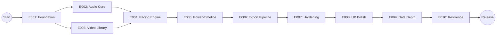

# Project Implementation Plan: PB Studio (AMD-Version)

**Product**: PB Studio | **Status**: Active | **Total Epics**: 5 (5 P1) | **Waves**: 3

## Epic Checklist

### Wave 1 — Foundation
> Basic media handling and indexing.

- [X] E001 [P1] [TECHNICAL] {SAD:ADR-0001} Foundation Setup — Project structure and hybrid architecture bootstrap.
- [X] E002 [P1] [PRODUCT] {PRD:CAP-001} Audio Analysis Core — BPM detection and beat tracking.
- [X] E003 [P1] [PRODUCT] {PRD:CAP-002} Smart Video Library — Local video indexing and AI tagging.

### Wave 2 — Orchestration
> AI Director and interactive editing.

- [X] E004 [P1] [PRODUCT] [P] {PRD:CAP-003} Auto-Pacing Engine — Rule-based timeline generation.
- [X] E005 [P1] [PRODUCT] [P] {PRD:CAP-004} Interactive Power-Timeline — Drag & Drop visual editor.

### Wave 3 — Delivery
> Hardware-accelerated export and final polish.

- [X] E006 [P1] [PRODUCT] {PRD:CAP-005} AMD Export Pipeline — Hardware-accelerated video rendering.
- [X] E007 [P2] [TECHNICAL] {STATUS:ReleaseReadiness} Release Hardening & UX Polish — Native dialogs, VRAM stress tests, and final UI refinements.
- [X] E008 [P2] [PRODUCT] Deeper UX & Timeline Polish — Magnetic snapping, smooth scrolling, and UI transitions.
- [X] E009 [P2] [TECHNICAL] Audio/Video Data Depth — Visualization of song sections, spectral data, and refined scene detection.
- [~] E010 [P2] [TECHNICAL] Resilience & Edge-Cases — Reconnect stress tests and extreme VRAM pressure validation. *(Code + SSE-Live-Verify ✓. 4h-Stress-Run als deferred runtime-Test.)* <!-- Tracking in Brain-Vault: 10_Projects/PB_studio/open-tasks/2026-05-19-post-timeline-merge.md (Punkt #16). Plan-Detail: specs/00010-resilience-edge-cases/plan.md -->

## Dependency Diagram

## Execution Wave Summary

| Wave | Epics | All Parallel? | Notes |
|------|-------|---------------|-------|
| 1 | E001, E002, E003 | No | E001 is prerequisite for others. |
| 2 | E004, E005 | Yes | Pacing engine and Timeline can be developed in parallel once data models exist. |
| 3 | E006, E007 | No | Final delivery and hardening stage. |
| 4 | E008, E009, E010 | No | Polish and Resilience. |

## Epic Details

### E008 — Deeper UX & Timeline Polish
- **Category**: PRODUCT
- **Priority**: P2
- **Source**: {STATUS:UX}
- **Acceptance criteria**:
    - [X] Smooth scrolling in TimelineView.
    - [X] Enhanced magnetic snapping (including onset markers).
    - [X] Consistent hover and selection states across all views.

### E009 — Audio/Video Data Depth
- **Category**: TECHNICAL
- **Priority**: P2
- **Source**: {STATUS:Refinement}
- **Acceptance criteria**:
    - [X] Automated song section detection (Intro, Chorus, Verse, etc.).
    - [X] Spectral centroid and RMS energy visualization on the timeline.
    - [X] Refined video scene detection using AdaptiveDetector.
    - [X] Persistent depth metadata storage in SQLite media cache.

### E010 — Resilience & Edge-Cases
- **Category**: TECHNICAL
- **Priority**: P2
- **Source**: {STATUS:Stability}
- **Acceptance criteria**:
    - [X] Verified SSE reconnection under failure conditions. *(Implementiert + live-verifiziert 2026-05-15. Commits: 7418274 SSEClient 5-attempt-threshold + IsBackendReachable Property, bc4e37e ConnectionStatus-Overlay-Banner. Live-Verify-Screenshot `scripts/qa/screenshots/sse_recovery_02_overlay.png` zeigt rotes Banner nach ~50s, dann clear bei Backend-Recovery.)*
    - [~] Passing "Low VRAM" stress test (simulated 4GB). *(Infrastructure ready: `PB_STUDIO_FORCED_VRAM=4096` env-var via VRAMArbiter (commit ef6e561 fixed constructor-crash), 4h-Stress-Script `scripts/qa/stress_4h.bat` → `src/tools/execute_4h_stress_test.py`. Live-Verify als deferred runtime-Test — laeuft ~4h, kann beilaeufig getriggert werden.)*
- **Status:** Substantiell vollstaendig. Code-Komponenten + Tests + SSE-Live-Verify ✓. 4h-Stress-Run = scheduled background-task.

## Coverage Validation

| PRD Capability | Epic | Status |
|----------------|------|--------|
| CAP-001 | E002 | Covered |
| CAP-002 | E003 | Covered |
| CAP-003 | E004 | Covered |
| CAP-004 | E005 | Covered |
| CAP-005 | E006 | Covered |

| SAD ADR | Epic | Status |
|---------|------|--------|
| ADR-0001 | E001 | Covered |

## Shared Artifact Surface

| Shared Entity | Introduced by | Consumed by |
|---------------|---------------|-------------|
| TimelineEntry | E001 | E004, E005, E006 |
| WaveformData | E002 | E005 |
| VideoMetadata | E003 | E004, E005 |

**Version**: 1.0.0 | **Last Amended**: 2026-04-24
