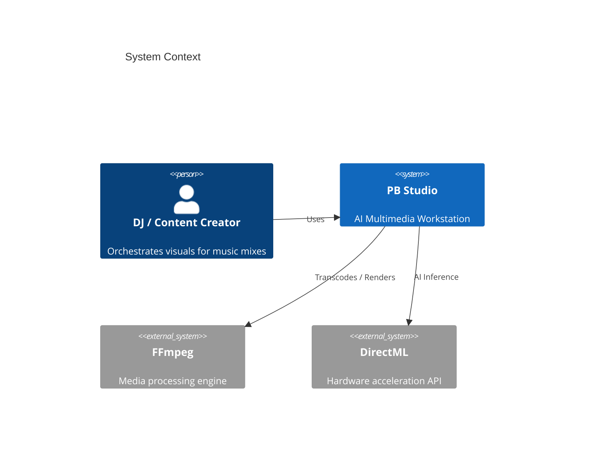
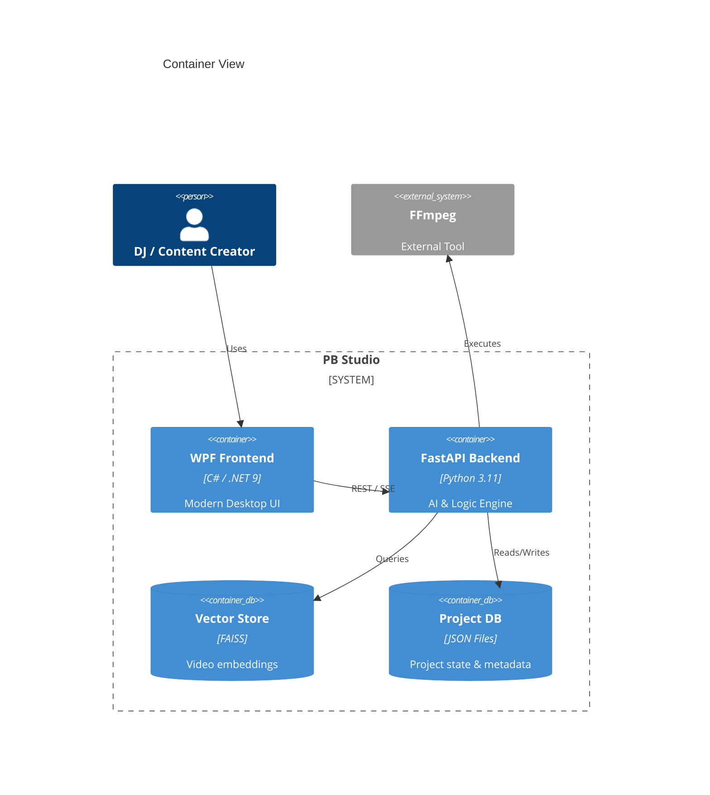
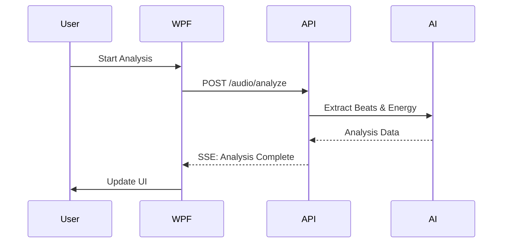
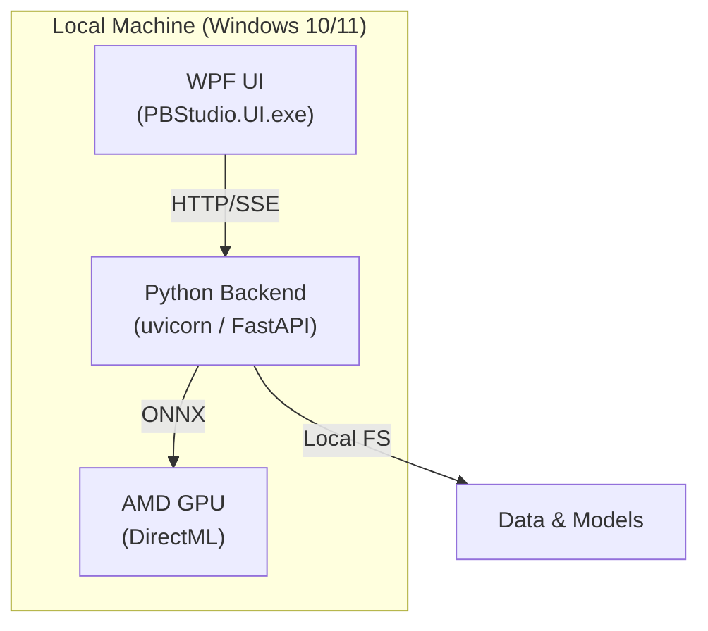

# Software Architecture Document: PB Studio (AMD-Version)

> Date: 2026-04-24 | Status: Draft

## Purpose and Scope
PB Studio is an AI-powered multimedia workstation for autonomous creation of beat-synced visuals for DJ mixes. It bridges the gap between high-effort manual editing and low-quality automated visualizers by providing a local-first, AI-driven director that orchestrates thousands of clips based on audio triggers.

## Technical Context

**Language/Version**: Python 3.11, C# (.NET 9)  
**Primary Dependencies**: FastAPI, onnxruntime-directml, FFmpeg, FAISS, CommunityToolkit.Mvvm, MaterialDesignInXaml 
**Storage**: local file system (JSON for project state), FAISS (Vector database)  
**Testing**: pytest (Python), dotnet test (C#), pywinauto (E2E) 
**Target Platform**: Windows 10/11 Desktop
**Project Type**: hybrid desktop application (C# UI + Python Backend) 
**Performance Goals**: < 1.0s UI response time; hardware-accelerated AI inference; zero-freeze timeline rendering.
**Constraints**: local-only processing; AMD DirectML support mandatory; zero cloud dependencies.
**Scale/Scope**: single-user desktop workstation; capable of processing mixes up to 4 hours and video libraries with > 10,000 clips.

## System Scope and Context
PB Studio acts as a standalone workstation. It consumes raw audio and video files from the local filesystem and produces rendered music videos.

### C4 System Context

### C4 Container View

## Solution Strategy and Architecture Style

- **Architecture Style**: Hybrid (WPF + REST API Backend)
- **Source Code Location**: All project source code resides in `/src` (Python logic), `/backend` (API), and `/PBStudio.UI` (WPF).
- **Why this style fits**: Combines the best-in-class desktop UI framework (WPF) with the dominant AI research ecosystem (Python).
- **Alternatives considered**: 
    - PyQt/PySide: Rejected for inferior UI performance and limited modern styling compared to WPF.
    - Electron: Rejected for higher resource overhead and difficulty in deep hardware (DirectML) integration.

## Key Runtime Flows and Failure Paths

### Primary Flow (AI Director)

### Failure Paths

- **GPU TDR (Timeout)** -> System catches DirectML exceptions, lowers concurrency, and retries on CPU if necessary.
- **API Disconnect** -> WPF UI implements an automatic reconnection strategy for the Python bridge.

## Deployment and Infrastructure View

## Cross-Cutting Concerns

### Security
Local-only execution ensures data privacy. No user authentication is required as it is a single-user desktop application.

### Reliability
Heavy AI tasks run in background worker threads to ensure UI responsiveness. Crash handlers in the backend catch SIGSEGVs and log them for debugging.

### Observability
Structured logging (colorlog) in Python and standard .NET logging in C#. Real-time GPU telemetry (VRAM, Temp) provided via SSE.

### Data Management
Project state is stored in a `project.json` file per project. Media metadata and embeddings are cached locally to minimize re-analysis.

## Quality Attributes

| Attribute | Target | Measurement | Notes |
|-----------|--------|-------------|-------|
| Performance | < 2.0s | P95 UI latency | During background analysis |
| Compatibility | AMD/Intel/NV | Smoke Test | Via DirectML |
| Precision | < 10ms | Sync Drift | Audio/Video cut alignment |

## Architecture Decision Records

| ADR ID | Title | Status | Date | Supersedes | File |
|--------|-------|--------|------|------------|------|
| ADR-0001 | Hybrid Architecture with DirectML | accepted | 2026-04-24 | — | [0001-hybrid-architecture-directml.md](adrs/0001-hybrid-architecture-directml.md) |

## Risks, Assumptions, Constraints, and Open Questions

### Risks
- **Dependency Hell**: Matching Python environment versions with DirectML and FFmpeg AMF.

### Assumptions
- User has an AMD GPU for hardware acceleration.

### Constraints
- Offline-first: Cannot rely on cloud services for AI inference.

## Project Context Baseline Updates
- [None yet]
